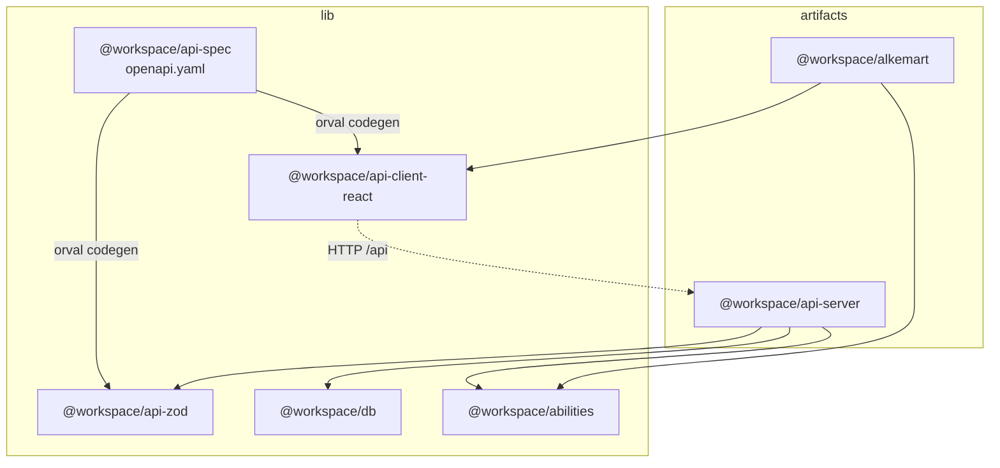
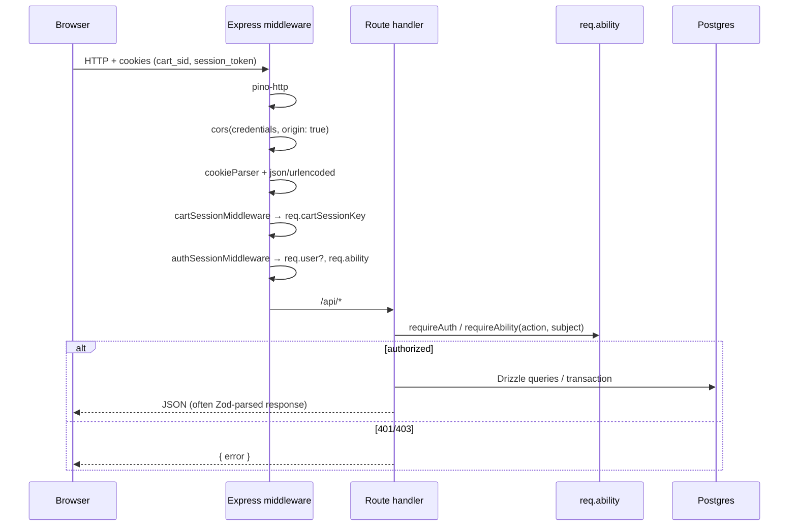
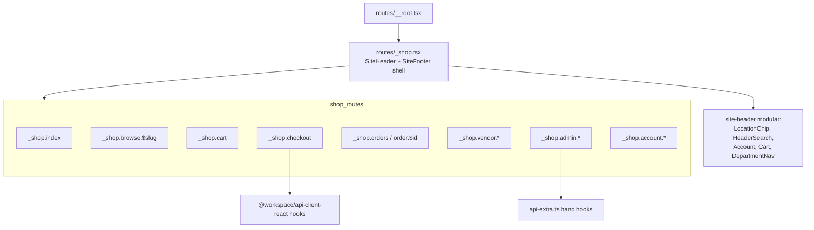
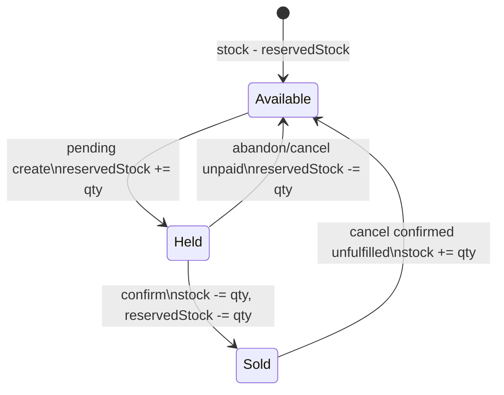
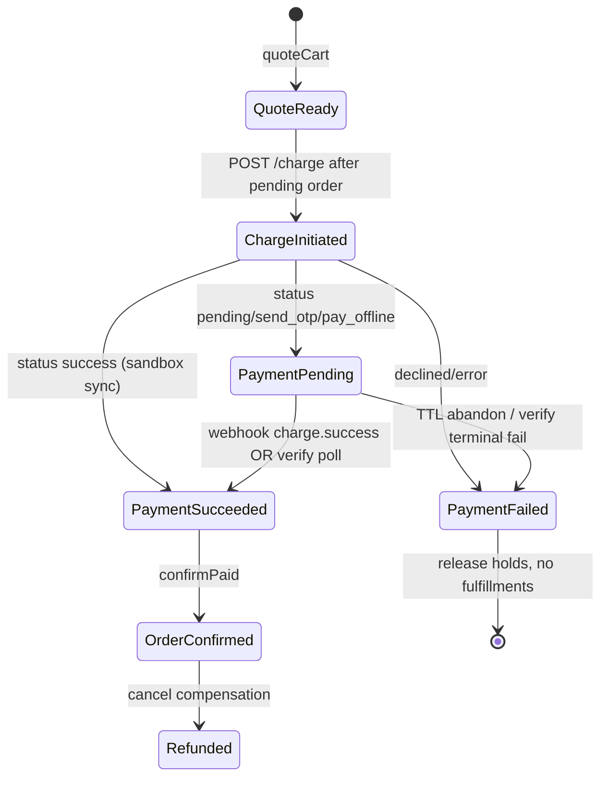
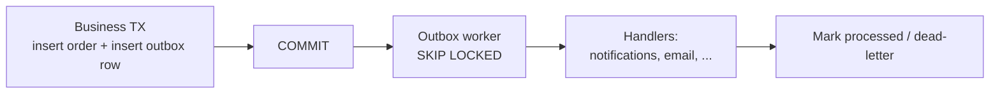
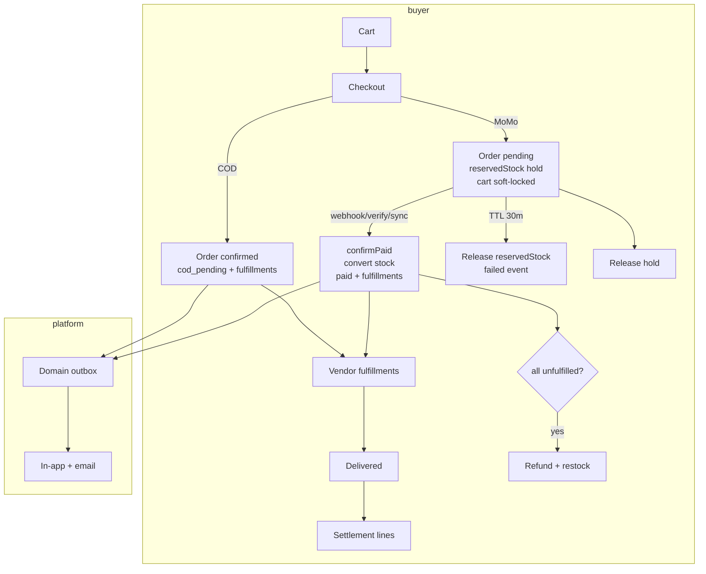

# Alkemart Architecture & Commercial Spine Design

| Field | Value |
|---|---|
| **Title** | Alkemart Architecture & Commercial Spine Design |
| **Author** | _TBD (engineering)_ |
| **Date** | 2026-07-13 |
| **Status** | Ready for implementation |
| **Scope** | Living architecture specification + target-state design for the commercial spine (payment / order / settlement) |
| **Codebase** | `/mnt/c/src/Alkemart4` |
| **Audience** | Senior engineers implementing the commercial spine without re-discovering the monorepo |
| **Revision** | R2 — promo confirm-time revalidation + charge crash/orphan recovery playbook |

---

## Overview

Alkemart is a **Ghana-first multi-vendor marketplace** monorepo: Express + Drizzle + Postgres API, React + TanStack Router storefront/vendor/admin UI, OpenAPI-first contracts, shared CASL abilities, and integer-pesewas money. The commercial core already has a real checkout path (mobile money via Paystack charge-before-order, cash-on-delivery, addresses with Ghana Post GPS `digitalAddress`, multi-vendor fulfillments, append-only payment events, order-linked disputes). What it lacks is a **production-grade payment state machine** (async MoMo approval + webhooks), **honest cancel compensation** (stock restore + real refunds gated on unfulfilled ship-state), **vendor settlement**, and **durable domain events** for multi-instance deploy.

This document is **not** a greenfield redesign. It documents the **as-built architecture** with file citations, then specifies the **target commercial spine** that builds on existing tables, patterns, and invariants—especially charge-before-commit, pesewas integers, coarse CASL + row-level checks, and honest shipping/tax contribution to totals (env-defaulted zeros; not separate order columns today).

**Implementation readiness:** money- and inventory-critical decisions below are **closed** (not open questions): stock hold model, payment event uniqueness, pending side effects, payment TTL, webhook verification, and cancel state matrix.

---

## Background & Motivation

### Why this change is needed

1. **Production MoMo is asynchronous.** `chargeMobileMoney` in `artifacts/api-server/src/lib/paystack.ts` only accepts `data.status === "success"`. In Paystack production, Ghana mobile money charges typically return `send_otp` / `pay_offline` / `pending` until the buyer approves USSD/prompt; webhooks (`charge.success`) complete the flow. Today's success-only sync path works in sandbox and fails for real buyers who must authorize on-device.
2. **Cancel is incomplete.** `POST /orders/:id/cancel` flips `orders.status` to `cancelled` and inserts a `refunded` ledger row with `amountPesewas: 0` and a manual note—no stock restore, no Paystack refund, no fulfillment-state gate.
3. **Settlement is unmodeled.** `vendors.commissionBps` (default 700 = 7%) and `vendors.paystackRecipientCode` exist; no payout ledger, admin mark-paid flow, or Transfer API integration reads them.
4. **Events are process-local.** `domainEvents` (`artifacts/api-server/src/lib/events.ts`) is an in-memory `EventEmitter`. Multi-instance or process restart loses undelivered side effects (notifications/email).
5. **Doc drift.** `docs/ecommerce-audit.md` (2026-07-09) still claims no Paystack, no addresses table, freeform disputes—**stale relative to current code**.

### Current state (high level)

A buyer can: sign up, browse catalog, manage cart (`cart_sid` cookie), save Ghana addresses, checkout with MoMo (sync charge) or COD, track orders, open order-linked disputes, receive in-app + email notifications. Vendors manage products, advance fulfillment, see analytics. Admins moderate images, vendors, promotions, homepage, disputes, and role grants.

### Pain points for commercial launch

| Pain | Evidence |
|---|---|
| MoMo async not supported | `paystack.ts` throws if status ≠ `success` |
| Cancel does not compensate inventory/money | `orders.ts` cancel handler |
| No vendor payouts | columns only on `vendors` |
| Event bus not HA-safe | `EventEmitter` in `events.ts` |
| Contract drift via `api-extra.ts` | hand-written admin users + password hooks (password is in OpenAPI but codegen is stale; admin users + PATCH vendor shop missing from OpenAPI) |
| Dual package managers | root `packageManager: bun@1.3.14` + `pnpm-workspace.yaml` + scripts mixing both |

---

## Goals & Non-Goals

### Goals

1. Document accurate **as-built** monorepo architecture so new engineers do not rediscover it.
2. Specify **target payment / order / settlement lifecycle** (webhook-driven MoMo, cancel compensation, settlement ledger v1).
3. Specify **durable domain events** (transactional outbox) replacing pure in-process emission for multi-instance.
4. Align **fulfillment FE/BE** (location chip vs checkout reality).
5. Improve **contract hygiene** (OpenAPI as sole client source; absorb remaining `api-extra` endpoints; CI codegen freshness).
6. Codify **AuthZ helper pattern** for vendor isolation.
7. Define **ops** story: package manager, env matrix, shared platform config.
8. Deliver an **incremental PR plan** that is independently reviewable and mergeable.

### Non-Goals

- Full redesign of storefront UX / Walmart-style chrome (covered by separate frontend specs under `docs/superpowers/`).
- External courier integrations, rate engines, or label printing (fulfillments remain internal status trackers).
- Multi-currency live checkout (GHS-only; markets list is UX scaffolding).
- Self-serve vendor onboarding marketplace (roles remain admin/DB granted unless a separate project opens).
- Real-time chat infrastructure beyond existing conversations table.
- VAT/NHIL engine implementation (keep honest zeros / env flat fees until a tax project).
- i18n framework rollout (English-only continues for this spine).
- **Per-vendor partial cancel** of multi-vendor orders (explicitly out of scope for this spine; all-or-nothing only).
- Promo discount allocation to vendor settlement lines (v1: marketplace absorbs promo; commission on full line subtotals).

---

## Part A — Current Architecture (As-Built)

### A.1 Monorepo packages and dependency graph

**Workspace roots** (both declared; runtime is migrating):

- `package.json` → Bun workspaces: `artifacts/*`, `lib/*`, `scripts`; `packageManager: "bun@1.3.14"`.
- `pnpm-workspace.yaml` → packages: `artifacts/*`, `lib/*`, `lib/integrations/*`, `scripts`; catalog + supply-chain `minimumReleaseAge`.
  - Note: `lib/integrations/*` is listed in the workspace file but **the directory does not exist** today (harmless empty glob).

| Package | Path | Role |
|---|---|---|
| `@workspace/alkemart` | `artifacts/alkemart` | Storefront + vendor + admin SPA (Vite, TanStack Router/Query, Radix/shadcn) |
| `@workspace/api-server` | `artifacts/api-server` | Express 5 API, checkout, Paystack, domain events |
| `@workspace/mockup-sandbox` | `artifacts/mockup-sandbox` | UI mockup playground (not production path) |
| `@workspace/db` | `lib/db` | Drizzle schema + `pg` pool exports |
| `@workspace/abilities` | `lib/abilities` | Shared CASL `defineAbilitiesFor` |
| `@workspace/api-spec` | `lib/api-spec` | `openapi.yaml` + Orval config (`codegen` script) |
| `@workspace/api-zod` | `lib/api-zod` | Generated Zod request/response schemas |
| `@workspace/api-client-react` | `lib/api-client-react` | Generated React Query hooks + `customFetch` |
| `@workspace/scripts` | `scripts` | Seed (`seed-homepage`), ops helpers |



**Codegen path:** `pnpm --filter @workspace/api-spec run codegen` (or workspace equivalent) → Orval (`lib/api-spec/orval.config.ts`) writes:

- React Query client → `lib/api-client-react/src/generated/`
- Zod validators → `lib/api-zod/src/generated/`

Server validates with `@workspace/api-zod` (e.g. `CheckoutBody`, `CheckoutResponse` in `routes/orders.ts`). Frontend prefers generated hooks; exceptions live in `artifacts/alkemart/src/lib/api-extra.ts` (password change, vendor shop patch, admin users/roles). OpenAPI already defines `POST /auth/password` (`changeMyPassword`) and `GET /vendor/shop`, but generated client lacks a password hook (stale codegen) and OpenAPI still misses admin users + `PATCH /vendor/shop`.

### A.2 Request lifecycle

Entry: `artifacts/api-server/src/index.ts` listens on `PORT`; `app.ts` mounts middleware then `/api` router.



**Middleware chain** (`artifacts/api-server/src/app.ts`):

1. `pino-http` (request logging; strips query string from logged URL)
2. `cors({ credentials: true, origin: true })`
3. `cookieParser()`
4. `express.json()` / `urlencoded` — **global JSON parser; webhook raw-body must mount before this or use a path-specific raw parser (see B.1.6)**
5. `cartSessionMiddleware` — cookie `cart_sid` (httpOnly, sameSite lax, 1y); mints UUID if missing → `req.cartSessionKey`
6. `authSessionMiddleware` — cookie `session_token` → load session + user + roles → `req.user`, always sets `req.ability = defineAbilitiesFor(roles)`
7. `app.use("/api", router)` — domain routers from `routes/index.ts`

**Auth model** (`artifacts/api-server/src/lib/auth.ts` + sessions table):

- Password: scrypt (`salt:hex` stored)
- Session: UUID token in `sessions` table with `expiresAt` (`SESSION_TTL_DAYS`, default 30)
- Cookie: `session_token`, httpOnly, sameSite lax, `secure` in production
- New signups get `buyer` role only (no self-serve vendor/admin — see `.agents/memory/alkemart-no-selfserve-roles.md`)

**CASL guards:**

- `requireAbility(action, subject)` — 401 if no user, 403 if `!req.ability.can(...)`
- Coarse ability is **not** a substitute for row-level checks (documented on `defineAbilitiesFor` and enforced e.g. in `vendor.ts` product patch/delete)

### A.3 Domain map

| Domain | Primary files | Notes |
|---|---|---|
| **Auth** | `routes/auth.ts`, `lib/auth.ts`, `schema/users.ts`, `sessions.ts`, `user-roles.ts` | signup/login/logout/me/profile/password |
| **Cart** | `routes/cart.ts`, `lib/cart.ts`, `schema/carts.ts` | session-keyed cart; inactive product cleanup on GET |
| **Catalog** | `routes/catalog.ts`, `schema/products.ts`, `categories.ts`, `vendors.ts` | list/detail, vendor storefront by slug; ILIKE search |
| **Checkout** | `routes/orders.ts` POST `/checkout`, `lib/checkout.ts`, `lib/paystack.ts` | quote → charge (momo) → transaction commit |
| **Paystack** | `lib/paystack.ts` | `chargeMobileMoney`, `refundMomoCharge`; env `PAYSTACK_SECRET_KEY` |
| **Orders** | `routes/orders.ts`, `schema/orders.ts` | buyer list/detail, cancel, admin list, vendor line view |
| **Vendor** | `routes/vendor.ts` | shop, products CRUD, fulfillment transitions, analytics |
| **Admin** | `routes/admin.ts` | vendors, disputes, analytics, users/roles, homepage (also promotions/images routers) |
| **Addresses** | `routes/addresses.ts`, `schema/addresses.ts` | CRUD + default; Ghana `digitalAddress` |
| **Images** | `routes/images.ts`, `schema/images.ts`, `objectStorage.ts` | presign intent → upload → admin approve/reject |
| **Promotions** | `routes/promotions.ts`, `lib/promotions.ts`, `schema/promotions.ts` | code-based %/fixed; FOR UPDATE usage limit |
| **Disputes** | `routes/disputes.ts`, admin dispute patches | buyer `POST /disputes` with real `orderId` FK |
| **Notifications** | `routes/notifications.ts`, `lib/events.ts`, `schema/notifications.ts` | in-app + Resend email subscribers |
| **Conversations** | `routes/conversations.ts` | buyer/vendor/admin messaging |
| **Homepage** | `routes/homepage.ts`, `schema/homepage-sections.ts` | admin-configurable sections |
| **Health** | `routes/health.ts` | liveness |

### A.4 Data model highlights

#### Money: integer pesewas

All catalog and order amounts are **integer minor units** (pesewas). Display helpers:

- Server: `artifacts/api-server/src/lib/money.ts` (`pesewasToLabel`, `pesewasToCodeLabel`)
- Client: `artifacts/alkemart/src/lib/money.ts` (same idea + market symbol mapping)
- Platform defaults: **`artifacts/api-server/src/lib/platform-config.ts`** → `DEFAULT_CURRENCY=GHS`, `DEFAULT_CURRENCY_SYMBOL=GH₵`

**Shipping/tax (as-built):** `quoteCart` / `runCheckoutWorkflow` add `QUOTE_SHIPPING_PESEWAS` and `QUOTE_TAX_PESEWAS` (env, default 0) into `totalPesewas`. These are **computed at quote/checkout time**, not stored as separate columns on `orders` (only `subtotalPesewas`, `discountPesewas`, `totalPesewas` persist). UI (`OrderSummaryCard`) uses "Calculated at checkout" when rates are unknown rather than inventing free shipping.

#### Multi-vendor orders

- One `orders` row per checkout (buyer-level).
- `order_items` denormalize `vendorId`, `titleSnapshot`, `pricePesewasSnapshot`.
- One `fulfillments` row per `(orderId, vendorId)` unique; forward-only status machine:
  - `unfulfilled → packed → shipped → delivered` (`FULFILLMENT_STATUS_TRANSITIONS` in `schema/fulfillments.ts`)

**Order-level `status` vs fulfillments (as-built):** `ORDER_STATUSES` includes `pending | confirmed | fulfilled | cancelled`. Today's success path writes `confirmed` immediately. `fulfilled` is rarely set by live code (analytics tests insert it); there is **no automatic rollup** when all vendor fulfillments reach `delivered`. Cancel target design relies primarily on **fulfillment rows**, not order-level `fulfilled` (see B.2).

#### Payment events ledger (append-only)

`order_payment_events`:

| type | When today |
|---|---|
| `paid` | MoMo after successful charge, recorded inside checkout TX |
| `cod_pending` | COD orders |
| `refunded` | Cancel path (currently amount 0 + manual note); also intended for real refunds |
| `failed` | Enum present; not widely written yet |

Fields: `amountPesewas`, `provider`, `providerReference`, `note`, `createdAt`. Index today: `order_payment_events_order_id_idx` only — **no uniqueness on provider reference**.

#### Addresses + digitalAddress

`addresses` table: `fullName`, `phone`, `line1`, `city`, `region`, optional `digitalAddress` (Ghana Post GPS), `countryCode` default `GH`, `isDefault`. Orders reference `addressId` with `ON DELETE RESTRICT`.

#### Vendors commercial fields (unused in flows)

- `commissionBps` default **700** (7%)
- `paystackRecipientCode` nullable
- `status`: `active` | `suspended`

#### Inventory

`products.stock` + `products.reservedStock`. Checkout **today**:

1. Conditional `UPDATE ... SET reservedStock = reservedStock + qty WHERE stock - reservedStock >= qty`
2. On success **in the same TX**: `stock -= qty`, `reservedStock -= qty`

Async pending MoMo **must split these steps** (see B.1.2).

#### Disputes (current, not audit-stale)

`disputes.orderId` maps to column `order_ref` but is a **real FK** to `orders.id` (`onDelete: restrict`). Buyer creates via `POST /disputes` with ownership check.

#### Code comment drift

`runCheckoutWorkflow` header comment still says “no live payment gateway” / synthetic paid event in places while the body documents Paystack — as-built comment drift; cleanup is optional in PR-1 or a tiny chore.

### A.5 Frontend layering



**Key patterns:**

- File-based TanStack Router under `artifacts/alkemart/src/routes/`
- Checkout requires auth: `requireAuthBeforeLoad` in `_shop.checkout.tsx`
- Commerce honesty: `OrderSummaryCard` defaults shipping/taxes to **"Calculated at checkout"**; server folds env shipping/tax into `totalPesewas` (default 0)
- `commerce-content.ts`: departments, PLP filters; **no invented pickup store list** (`PICKUP_STORES = []`)
- `location-chip.tsx`: delivery/pickup/shipping mode in **localStorage** (`alkemart_fulfillment_mode`, `alkemart_pickup_store`) — **not sent to checkout API**
- Modular header: `site-header.tsx` composes location, search, account, cart, departments, notifications

### A.6 Trust model (AuthZ)

**Layer 1 — Coarse CASL** (`lib/abilities/src/index.ts`):

| Role | Capabilities (summary) |
|---|---|
| `buyer` | read Product; create/read Order, Conversation |
| `vendor_owner` | manage Product/Vendor/Image scoped by owned vendorIds; read Order; update Fulfillment |
| `vendor_staff` | read/update Product, Fulfillment, Image for staff vendors; read Order |
| `support_agent` | read Order; manage Dispute/Conversation; **read** AdminPanel |
| `admin` | `manage` all |

Vendor scope is computed **per role**, not pooled (prevents owner privileges bleeding onto staff-only vendors).

**Layer 2 — Row-level checks** (required):

Examples:

- Order detail: buyer OR vendor-on-order OR admin/support (`orders.ts` GET `/:id`)
- Vendor product mutate: `vendorIdsFor(roles).includes(product.vendorId)`
- Address ownership at checkout
- Admin vendor PATCH: `requireAbility("read", "AdminPanel")` **plus** `isAdmin()` so support cannot mutate vendor status (`.agents/memory/alkemart-admin-authz-pattern.md`)
- Analytics: `vendorIdsFor` isolation covered by tests (`analytics-vendor-isolation.test.ts`)

**CASL subject `Payout` exists** in the Subjects union but **no ability rules grant it yet** — reserved for settlement work.

### A.7 Production-grade vs prototype today

| Area | Grade | Notes |
|---|---|---|
| Checkout stock reservation | **Production-shaped** | Conditional SQL + single TX; race tests |
| Promo usage limits | **Production-shaped** | `FOR UPDATE` + redemptions ledger |
| MoMo charge-before-order + post-fail refund | **Sandbox-ready** | Correct ordering; sync success-only |
| COD payment method | **MVP** | Ledger `cod_pending`; no courier cash reconciliation |
| Addresses + Ghana digital address | **MVP production** | Real CRUD; used at checkout |
| Order-linked disputes | **MVP** | FK + buyer create; admin status-only |
| Cancel | **Prototype** | Status flip only; fake refund event |
| Settlement / commission | **Schema-only** | Columns unused |
| Domain events | **Single-process MVP** | Fire-and-forget EventEmitter |
| Image moderation pipeline | **Production-shaped** | Presign + review queue |
| Search / catalog scale | **Prototype** | ILIKE + offset pagination |
| Reviews/ratings | **Schema-only** | columns never written |
| Self-serve vendor onboarding | **Not built** | Manual DB roles |
| Webhooks / payment pending UX | **Not built** | — |
| Contract completeness | **Mostly good** | OpenAPI has password; codegen stale; admin users + PATCH shop only in `api-extra` |
| Package manager | **Ambiguous** | bun.lock + pnpm-workspace coexist |

### A.8 Doc drift: `docs/ecommerce-audit.md`

The 2026-07-09 audit is **partially obsolete**. Update any planning that still trusts these claims:

| Audit claim | Current reality |
|---|---|
| No real payment capture; synthetic always-`paid` | MoMo charges Paystack before order; COD uses `cod_pending` |
| `paystackRecipientCode` unused and no Paystack code | Charge/refund implemented; recipient still unused (settlement) |
| Disputes freeform `orderRef` text | Real `orderId` FK to `orders` |
| Address model hardcoded mock only | `addresses` table + API + checkout wired |
| Checkout "coming soon" address/payment | Live MoMo provider/phone + address selection UI |
| No cancellation route | `POST /orders/:id/cancel` exists (incomplete compensation) |

**Recommendation:** mark the audit as historical or add a banner pointing to this architecture doc as the living source of truth.

---

## Part B — Target Design: Commercial Spine

### B.1 Payment state machine (MoMo)

#### B.1.1 Problem

```
Today (sync success-only):
  quoteCart → charge (must be success) → runCheckoutWorkflow(confirmed, paid event)
  else PaymentDeclinedError / refund if post-charge TX fails
```

Production MoMo often returns **non-terminal** statuses. Forcing success-only means either (a) hang the HTTP request until timeout, or (b) fail valid pending authorizations.

#### B.1.2 Stock hold model — **DECIDED** (ADR-011)

Aligns with cancel restore and today's reserve pattern; **one decrement model only**.

| Phase | `reservedStock` | `stock` | Notes |
|---|---|---|---|
| **Pending create (MoMo async)** | `+= qty` (guarded: `stock - reservedStock >= qty`) | **unchanged** | Hold only |
| **Confirm (webhook / sync success / COD success path)** | `-= qty` | `-= qty` | Same relative SQL as today's convert step |
| **Cancel / abandon pending (unpaid)** | `-= qty` only | **unchanged** | Release hold |
| **Cancel confirmed (paid, all unfulfilled)** | assert not still holding these units | `+= qty` | Restock sold units |



**COD path:** can keep today's single-TX reserve+convert+confirm (no async), or create confirmed immediately with convert — no long-lived hold.

#### B.1.3 Target states



#### B.1.4 Pending order lifecycle — **DECIDED** (side effects table)

| Entity / effect | `createPending` (MoMo non-terminal or post-hold pre-confirm) | `confirmPaid` | `abandon` (TTL) / `cancel` unpaid | `cancel` confirmed paid |
|---|---|---|---|---|
| Order row | Insert `status=pending`, snapshot totals, address, paymentMethod | → `confirmed` | → `cancelled` (or failed terminal) | → `cancelled` |
| Order items | Insert snapshots | unchanged | remain for audit | remain for audit |
| Stock | `reservedStock += qty` only | convert: `stock -=`, `reservedStock -=` | `reservedStock -=` only | `stock +=` |
| Cart lines | **Do NOT clear** (see soft-lock below) | Clear cart lines matching order | Unlock soft-lock | n/a (already cleared on confirm) |
| Promo validation | Best-effort validate only (FOR UPDATE is **UX-only**, not a capacity reservation); **no** `promotion_redemptions` insert; snapshot `promotionCode` + expected `discountPesewas` on order | **Re-validate under `FOR UPDATE`** then insert redemption if still valid; if invalid/over-limit after capture → **abort confirm + refund** (B.1.4a) | Nothing burned | n/a |
| Fulfillments | **Do NOT create** | Create one per vendor `unfulfilled` | none exist | all must be `unfulfilled` |
| Payment events | `payment_pending` (+ intent row) | append `paid` | append `failed` if never captured | append `refunded` / `refund_failed` |
| Domain events | optional `order.payment_pending` (buyer UX only) | **`order.placed`** (notifications/email) | `order.cancelled` / payment failed | `order.cancelled` |
| Vendor order list | **Hide** unpaid pending from vendor ops (filter `status != pending` or no fulfillments) | Visible | Hidden/cancelled | Visible as cancelled |

**Cart soft-lock (required):**

- At `createPending`, set `carts.checkoutLockOrderId = order.id` (new nullable column) **or** equivalent `cart_items.lockedByOrderId` so concurrent `POST /checkout` returns **409** “checkout already in progress” while a non-terminal pending order exists for this cart/session.
- **Do not delete cart lines** until `confirmPaid`.
- On abandon/cancel unpaid: clear lock; cart lines remain so the buyer can retry.
- On confirm: clear cart lines + lock (same as today's clear).

**Re-checkout rule:** while lock held, reject new checkout for that cart. After abandon, buyer may checkout again (fresh quote/charge).

#### B.1.4a Limited promo concurrency — **DECIDED**

Deferring redemption until confirm (ADR-012) correctly avoids burning usage on abandoned MoMo, but **re-opens a race**: N concurrent pending checkouts can each pass a best-effort usage check at `createPending` (the `FOR UPDATE` ends when that TX commits), then all attempt `confirmPaid` against `usageLimit=1`. Today's sync path avoids this by validate+redeem in **one** TX (`promotions.ts` + `checkout.ts`).

**Policy (same spirit as charge-amount mismatch):**

1. **`createPending` promo check is best-effort only** — improves early 400 UX; **does not** reserve capacity. Document this so implementers do not treat it as a lock.
2. **`confirmPaid` must always re-run promo validation under lock** before inserting a redemption:
   - `SELECT promotion ... FOR UPDATE` (same pattern as `validateAndComputePromotionDiscount`)
   - Recompute discount from order subtotal; must match snapshotted `discountPesewas` / code still active / within window / usage count `< usageLimit`
3. **If revalidation fails after money is already captured** (webhook, sync success, or refresh):
   - **Do not confirm** the order (no fulfillments, no `order.placed`, no stock convert — or if convert already started in same TX, roll back the whole TX)
   - Release `reservedStock` (order still `pending` at start of this path)
   - Set order `cancelled` (or terminal failed)
   - Call `refundMomoCharge` with the durable reference
   - Append ledger: `failed` (promo) + `refunded` / `refund_failed`
   - Unlock cart
   - Return/log clear buyer-facing reason when in request path: “Promo code is no longer available — payment refunded”
4. **Discount amount drift:** if code still valid but computed discount ≠ snapshotted `discountPesewas` (and thus would change total vs charged amount), treat as **amount mismatch**: abort confirm + refund (do not silently change total after capture).

**Tests required (PR-6b):** concurrent two pending orders with `usageLimit=1`; exactly one confirms; loser refunds and releases stock (mirror `checkout-promo-race.test.ts` shape).

#### B.1.5 Sequence (webhook-driven)

```mermaid
sequenceDiagram
  participant FE as Checkout UI
  participant API as api-server
  participant PS as Paystack
  participant DB as Postgres
  participant WH as Webhook handler
  participant TTL as Abandonment worker

  FE->>API: POST /checkout (momo)
  API->>DB: TX createPending: order pending, items,\nreserve reservedStock, soft-lock cart,\npayment_intent initiated\n(+ clientReference if used)
  API->>PS: POST /charge with metadata.order_id +\nmetadata.payment_intent_id (required)
  PS-->>API: reference + status pending|success
  API->>DB: TX durableReference: set providerReference +\nstatus on intent (before HTTP 202/200)
  alt sync success
    API->>DB: confirmPaid (promo FOR UPDATE revalidate,\nconvert stock, paid, fulfillments, cart, outbox)
    API-->>FE: 200 Order confirmed
  else pending
    API-->>FE: 202 Order pending + payment fields
    FE->>FE: Poll GET /orders/:id (derivePaymentStatus)
    PS->>WH: charge.success (HMAC verified)
    WH->>DB: resolve intent by reference OR metadata;\nconfirmPaid (promo revalidate)
    Note over TTL: if payment_expires_at passed\nwithout paid: release hold; recovery job\nstill refunds known captures
  end
```

#### B.1.6 Payment intents + event uniqueness — **DECIDED**

**Do not** put a blanket unique index on `order_payment_events.provider_reference` — refunds must re-use the same Paystack transaction reference as the original charge (ADR-005).

**Chosen model:**

1. **`payment_intents` table** (or `charges`) with **unique `(provider, provider_reference)`** when reference is non-null.
   - Columns (minimum): `id`, `orderId`, `provider` (`paystack`), **`clientReference`** (unique UUID, set at insert **before** charge), `providerReference` (nullable until charge returns / recovery), `amountPesewas`, `currency` (`GHS`), `status` (`initiated|pending|succeeded|failed|expired`), `rawLastStatus`, `createdAt`, `updatedAt`, `expiresAt`
2. **`order_payment_events`** remains **non-unique append-only** ledger (multiple rows may share a reference: `payment_pending`, `paid`, `refunded`, `failed`, `refund_failed`).
3. **Webhook idempotency:**  
   `SELECT payment_intent FOR UPDATE` by reference → if `status=succeeded` already (or order already has terminal `paid` event) → **no-op 200**.  
   Not “unique row in events table.”

Optional hardening: partial unique index on events  
`UNIQUE (provider, provider_reference) WHERE type IN ('paid','payment_pending') AND provider_reference IS NOT NULL`  
— nice-to-have secondary guard; **primary idempotency is `payment_intents`**.

#### B.1.7 Payment TTL + abandonment — **REQUIRED** (not optional)

| Setting | Value |
|---|---|
| Default TTL | **30 minutes** (`PAYMENT_PENDING_TTL_MINUTES`, env, default 30, min 10, max 120) |
| Storage | `orders.payment_expires_at` set at pending create; mirror on `payment_intents.expiresAt` |
| Worker | Interval sweeper (same process loop or cron): find `orders.status=pending` AND `payment_expires_at < now()` |
| On abandon | TX: FOR UPDATE order + intent; if still pending and no `paid` event: release `reservedStock`, set order `cancelled`, intent `expired`, append payment event `failed` (amount 0 or quoted amount with note “abandoned”), clear cart soft-lock, outbox `order.payment_expired` optional |
| Late webhook after TTL | FOR UPDATE intent: if `expired`/`cancelled` and Paystack reports success → **do not confirm**; call `refundMomoCharge`; append `refunded` or `refund_failed`; alert ops |

Paystack does **not** guarantee a failure webhook for every abandoned USSD path; TTL is the production backstop for inventory.

#### B.1.8 Paystack webhook & verify — **DECIDED**

**Signature verification (Paystack):**

- Header: `x-paystack-signature`
- Compute: `HMAC-SHA512(rawRequestBody, PAYSTACK_SECRET_KEY)` as hex
- Compare with timing-safe equality to the header value
- **Use `PAYSTACK_SECRET_KEY` only** — Paystack does **not** use a separate dashboard “webhook secret” for this HMAC. Do **not** introduce `PAYSTACK_WEBHOOK_SECRET` unless implementing app-level dual-key rotation later.

**Express raw body (required for correct HMAC):**

```text
// app.ts ordering (illustrative)
app.use(pinoHttp...)
app.use(cors...)
app.use(cookieParser...)
// Path-specific raw body BEFORE express.json():
app.post(
  "/api/webhooks/paystack",
  express.raw({ type: "application/json" }),
  paystackWebhookHandler,
);
app.use(express.json());
app.use(express.urlencoded...);
app.use(cartSession...);
app.use(authSession...);
app.use("/api", router); // other routes
```

**PR-5 test plan (raw body):** integration test that posts a known body + signature and asserts 200; regression that normal JSON routes still parse `req.body` objects.

**Handled events:**

| Event | Action |
|---|---|
| `charge.success` | **Required.** Resolve intent by `data.reference` **or** `metadata.payment_intent_id` / `metadata.order_id`; then idempotent `confirmPaid` (incl. promo revalidate, amount+currency) |
| Other success-like | Treat unknown carefully; log; only act when reference **or** required metadata maps to a known intent |
| Failure events | Best-effort: mark intent failed if never paid; **do not rely** on them — TTL covers abandon |

**Amount + currency checks on confirm:**

- `data.amount` must equal `order.totalPesewas` (Paystack amount is minor units)
- `data.currency` must equal `DEFAULT_CURRENCY` (`GHS`)
- Mismatch → do not confirm; **refund** if captured; alert ops (same class as promo/amount failure)

#### B.1.8a Durable reference + crash recovery — **DECIDED**

Crash after Paystack returns success/pending but before `providerReference` is durable would leave a capture the TTL path cannot refund. **Closed by layered durability + recovery:**

**1. Intent row before external charge (required)**

- `createPending` TX inserts `payment_intents` with `status=initiated`, `amountPesewas`, `currency`, `orderId`, `expiresAt`, and a server-generated **`clientReference`** (UUID) stored on the intent **before** any Paystack HTTP call.
- Prefer passing that value as Paystack charge `reference` when the API accepts client-supplied references; otherwise still store `clientReference` for our side and rely on metadata + post-response write for Paystack’s returned reference.

**2. Metadata on every MoMo charge (required, not optional)**

```json
{
  "metadata": {
    "order_id": "<orders.id>",
    "payment_intent_id": "<payment_intents.id>",
    "client_reference": "<payment_intents.clientReference>"
  }
}
```

Webhook / verify **must** join by:

1. `data.reference` → `payment_intents.provider_reference`, else
2. `metadata.payment_intent_id` or `metadata.order_id` / `client_reference`

After join, **persist** `providerReference` if still null, then run `confirmPaid` (or refund path).

**3. Post-charge durable write (required before HTTP response)**

```
On charge HTTP response (any non-transport failure with a body reference):
  BEGIN;
  lock intent FOR UPDATE;
  set providerReference, rawLastStatus, status=pending|succeeded;
  COMMIT;
If this TX fails but in-memory reference exists and status was success:
  attempt refundMomoCharge(reference);
  alert P0 "charge ok, persist failed";
  release holds / cancel pending as needed;
  do not return 200/202 as paid.
Only after durable reference (or explicit refund of known reference) return 202/200.
```

**4. Recovery job (required ops, PR-6b)**

Periodic job (same process interval as abandonment or adjacent):

1. Find `payment_intents` where `status=initiated` OR (`provider_reference` IS NULL AND order still `pending` AND `created_at` older than e.g. 2 minutes).
2. Call Paystack list/verify using **metadata filters** and/or `clientReference` / known email+amount heuristics; when a transaction is found, attach `providerReference` and either `confirmPaid` or mark pending.
3. If Paystack shows **success** for metadata-linked charge but order is cancelled/expired (TTL raced): **refund**, append `refunded`/`refund_failed`.
4. If no provider transaction found after TTL: safe to abandon holds only (no capture).
5. Alert on any success transaction in Paystack with our metadata that has no local `paid` and no successful `refunded`.

**5. Ops playbook (orphan captures)**

| Symptom | Action |
|---|---|
| Paystack dashboard shows success; no local order paid | Look up `metadata.order_id` / `payment_intent_id`; run admin “reconcile intent” (verify + confirm or refund) |
| Local intent has reference, order cancelled, no refund event | `POST /admin/orders/:id/retry-refund` |
| Local intent `initiated`, no reference, buyer says charged | Recovery job + dashboard search by email/phone/time; attach reference; refund if order abandoned |
| Persist TX failed after success body | Logs must include in-memory reference; page on-call; auto-refund path above |

**Verify endpoint:**

- Internal helper: `verifyPaystackTransaction(reference)` used by worker/poll/recovery
- Public/buyer surface: `POST /orders/:id/payment/refresh` — **must** require auth and order ownership (buyer or admin). **Never** expose unauthenticated `GET /paystack/verify/:reference` (reference oracle).
- Buyer poll primary path: `GET /orders/:id` includes **derived** `paymentStatus` (see B.1.9)

#### B.1.9 Derived payment status (API contract)

```typescript
// Fold order_payment_events (newest first) + order.status + payment_intents
type DerivedPaymentStatus =
  | "none"
  | "payment_pending"
  | "paid"
  | "cod_pending"
  | "failed"
  | "refunded"
  | "refund_failed";

function derivePaymentStatus(order, events, intent): DerivedPaymentStatus {
  // Precedence (first match wins when scanning for presence):
  // 1. any refund_failed → refund_failed
  // 2. any refunded with amount > 0 → refunded
  // 3. any paid → paid
  // 4. any failed (and no paid) → failed
  // 5. cod_pending → cod_pending
  // 6. payment_pending or intent pending and order.pending → payment_pending
  // 7. none
}
```

Expose on `GET /orders/:id` (and list items if cheap): `paymentStatus: DerivedPaymentStatus`, `paymentReference?: string`, `paymentExpiresAt?: string`.

**FE poll guidance (PR-7):**

- Interval: 2s, 3s, 5s backoff; cap ~5s
- Stop when `paymentStatus ∈ {paid, failed, refunded}` or order `cancelled` or wall clock > TTL + 60s
- Copy: “Approve the prompt/USSD on your phone…”

**Checkout OpenAPI:**

```http
POST /api/checkout
→ 200 application/json OrderDetail  # confirmed (COD or sync momo success)
→ 202 application/json OrderDetail  # status=pending, paymentStatus=payment_pending
→ 402 { error }                     # declined before/at charge
→ 409 { error }                     # cart locked / stock / promo
```

Orval: document both 200 and 202 with the **same** `OrderDetail` schema (includes `status`, `paymentStatus`). Client treats non-2xx as errors; 202 is success with pending semantics (custom mutator or check `status === 'pending'`).

#### B.1.10 Charge-then-commit evolution (ADR-003)

| Today | Target |
|---|---|
| Charge then create confirmed order | Create pending + reserve, then charge, store reference, confirm on success/webhook |
| Sync success-only | Pending + TTL + webhook; sync success still short-circuits to confirm in same request |

**Invariants retained:** never leave a **confirmed paid** order without provider success; never leave a successful capture without an order **or** refund attempt (including late-after-TTL, promo-fail-after-capture, amount mismatch, and post-charge persist failure — B.1.8a).

#### B.1.11 File touchpoints

- `artifacts/api-server/src/lib/paystack.ts` — pending statuses, verify, HMAC helper, refund, **required charge metadata**, optional client reference
- `artifacts/api-server/src/lib/checkout.ts` — split `createPendingCheckout` / `confirmPaidCheckout` (promo revalidate); keep COD path
- `artifacts/api-server/src/routes/orders.ts` — 200 vs 202; cancel matrix
- New webhook route + `app.ts` raw body mount; **orphan/recovery worker** next to TTL sweeper
- `lib/db` — `payment_intents` (+ `clientReference`), `payment_expires_at`, cart lock column, event type enums
- OpenAPI — OrderDetail payment fields, checkout multi-status

### B.2 Cancel compensation

#### B.2.1 Rules (v1)

Buyer cancel allowed when:

1. `order.buyerUserId === req.user.id` (admin override later optional)
2. Order status ∈ `{pending, confirmed}` (**not** `cancelled`; not relying on rare order-level `fulfilled`)
3. **If any fulfillment rows exist:** every row is `unfulfilled`.  
   **If zero fulfillment rows** (unpaid pending): cancel allowed (nothing packed).
4. **Partial / per-vendor cancel is out of scope** for this spine (Key Decision).

#### B.2.2 Locking (pack race)

Single TX:

```text
BEGIN;
SELECT order ... FOR UPDATE;
SELECT all fulfillments WHERE order_id = ? FOR UPDATE;  -- empty ok
-- re-check status + all unfulfilled
-- apply cancel + inventory ops
COMMIT;
-- then external refund if needed (after commit)
```

Vendor `PATCH` fulfillment must also lock the fulfillment row (already updates by id); the cancel TX's `FOR UPDATE` on all fulfillments serializes against concurrent pack transitions.

#### B.2.3 State matrix — inventory & money

| Order state | Payment | Fulfillments | Inventory op | Money op | Ledger |
|---|---|---|---|---|---|
| `pending` | unpaid / payment_pending | none | `reservedStock -= qty` | **no** refund | `failed` or note cancelled unpaid |
| `pending` | rare: paid but not confirmed (should not happen if confirm is atomic) | none | treat as confirmed path after repair | refund if paid event | — |
| `confirmed` | `paid` (momo) | all unfulfilled | `stock += qty` | `refundMomoCharge` | `refunded` amount=total **or** `refund_failed` |
| `confirmed` | `cod_pending` | all unfulfilled | `stock += qty` | none | note void COD |
| any | any | any not unfulfilled | **409** | none | none |
| `cancelled` | any | any | **409** already cancelled | none | none |

**Cancelled-with-debt:** if refund fails, order stays `cancelled`, append `refund_failed` with amount attempted + note; **ops queue** for retry. Order is cancelled; money debt is tracked in ledger (Open Q closed: allow cancelled-with-debt).

#### B.2.4 Algorithm

```text
1. BEGIN; lock order + fulfillments FOR UPDATE
2. Authz buyer
3. Guard status ∈ {pending, confirmed}; fulfillments all unfulfilled (or empty)
4. If pending unpaid:
     release reservedStock; status=cancelled; clear cart lock;
     append failed/cancel note; COMMIT; outbox order.cancelled; return
5. If confirmed:
     restock stock += qty per line; status=cancelled; COMMIT
6. After COMMIT, if momo and has paid event and no successful refunded yet:
     refundMomoCharge(full amount)
     append refunded (amount=total) OR refund_failed (amount=0, note)
7. Outbox order.cancelled
8. Ops: refund_failed rows appear in admin reconciliation list; retry endpoint
```

**Refund retry (required ops surface):**

- `POST /admin/orders/:id/retry-refund` (`isAdmin`), idempotent if already refunded
- Background optional sweeper for `refund_failed` older than N minutes (log/alert)

#### B.2.5 Order status `fulfilled`

Target: **do not require** order-level `fulfilled` for cancel logic. Optional later job: when all fulfillments are `delivered`, set `orders.status = fulfilled`. Cancel continues to use fulfillment rows as source of truth.

### B.3 Settlement / payout module (v1)

**Goal:** make commission and recipient codes operational even before automated Paystack Transfers.

#### Domain model (new tables)

```text
vendor_settlements
  id, vendorId, periodStart, periodEnd
  grossPesewas, commissionPesewas, netPesewas
  status: open | ready | paid | void
  paidAt, paidByUserId, paystackTransferCode nullable
  note, createdAt
  UNIQUE (vendorId, periodStart, periodEnd)  -- regenerate idempotency

vendor_settlement_lines
  id, settlementId, orderItemId, orderId
  itemSubtotalPesewas, commissionBpsSnapshot, commissionPesewas, netPesewas
```

#### Calculation — **DECIDED**

- **Trigger eligibility:** fulfillment for that vendor on the order is `delivered` (multi-vendor: lines enter settlement when **that** vendor delivered).
- **Commission base:** `order_items.subtotalPesewas` (**no** order-level promo allocation in v1). **Marketplace absorbs promo discount** relative to cash captured; document this to finance.
- **Exclude:** cancelled orders; items on orders with successful full refunds; lines already on a non-void settlement.
- **Formula:**  
  `commission = floor(itemSubtotal * commissionBpsSnapshot / 10000)`  
  `net = itemSubtotal - commission`  
  Snapshot `commissionBps` from vendor at generation time.
- **Timezone:** period boundaries in **`Africa/Accra`**.

#### v1 known limitations

- No promo allocation → vendor net can exceed buyer cash on heavily discounted multi-vendor carts; accept for pilot or fund promos from marketplace.
- Refunds after settlement generate → void/regenerate period or manual adjustment note (v1: exclude from new generates if order cancelled/refunded; already-paid settlements require manual void).

#### v1 API (manual mark-paid)

- `GET /admin/settlements` / `GET /vendor/settlements`
- `POST /admin/settlements/generate` — period rollup (idempotent unique vendor+period)
- `POST /admin/settlements/:id/mark-paid` — admin; records ledger; Transfers later

#### CASL

- `admin`: manage `Payout`
- `vendor_owner`: read `Payout` conditioned on vendorId
- Row-level filters with `vendorIdsFor`

### B.4 Domain event durability (outbox)

#### Problem

`domainEvents.emitEvent` after commit is correct for single process but fails multi-instance and crash windows.

#### Target: transactional outbox



**Table `domain_event_outbox`:**

| column | purpose |
|---|---|
| `id` | bigserial |
| `event_name` | e.g. `order.placed`, `order.cancelled`, `order.payment_pending` |
| `payload` | jsonb |
| `created_at` | |
| `processed_at` | null until done |
| `attempts` | int |
| `last_error` | text |
| `next_attempt_at` | backoff |

**Worker ops:**

- Multi-instance safe: `FOR UPDATE SKIP LOCKED`
- Retry: exponential backoff (e.g. 30s, 2m, 10m); **max attempts 10** then leave `processed_at` null with `attempts` capped and `last_error` — alert `outbox_poison`
- Dual-publish migration: write outbox in TX + emit EventEmitter for one release; acceptance: kill EventEmitter listeners in staging and confirm notifications still deliver via worker

**Handler idempotency (required):**

- In-app notifications: unique constraint or upsert on natural key `(user_id, type, (data->>'orderId'))` **or** store `outbox_id` in `data` and skip if notification with that outbox id exists
- Email: accept possible duplicate receipts on rare retry **or** track `emails_sent(outbox_id)` unique
- Extend typed `DomainEvents` map: `order.placed`, `order.cancelled`, `order.payment_pending`, `fulfillment.status_changed`, `order.payment_expired`

### B.5 Fulfillment FE/BE alignment

| Surface | Behavior today | Target |
|---|---|---|
| Header `LocationChip` | localStorage mode/store; pickup stores empty | Treat as **preference UX** only until stores API exists; copy: "Delivery preferences" not "availability" |
| Checkout `FulfillmentPicker` | UI control | Wire to checkout body **only when** BE accepts `fulfillmentMethod`; until then hide or mark non-binding |
| Checkout reality | Ship-to `addressId` only | Document: **all checkouts are delivery to address** |
| `PICKUP_STORES` | empty array (honest) | Keep empty; do not invent malls |
| ETA chips / express bands | marketing chrome | Keep non-binding unless rates engine lands |

**Principle (commerce honesty):** do not imply a fulfillment path the API cannot honor.

### B.6 Contract hygiene

1. **OpenAPI gaps to fill:**
   - `PATCH /vendor/shop`
   - `GET /admin/users`, `POST /admin/users/roles`, `DELETE /admin/users/:id/roles`
2. **Already in OpenAPI but codegen stale:** `POST /auth/password` (`changeMyPassword`) — re-run Orval and delete hand `useChangeMyPassword` once generated.
3. Delete `api-extra.ts` only for hooks that exist in generated client after codegen.
4. **CI gate:** `codegen` + `git diff --exit-code` on `lib/api-client-react/src/generated` and `lib/api-zod/src/generated`.
5. Webhook routes: internal; do not generate browser hooks.
6. Checkout 200/202 + OrderDetail `paymentStatus` in OpenAPI (see B.1.9).

### B.7 AuthZ helper pattern (vendor isolation)

Codify `artifacts/api-server/src/lib/authz.ts`:

```typescript
// Illustrative target API
export function assertVendorAccess(req: Request, vendorId: number): void { /* admin bypass; else vendorIdsFor includes */ }
export function requireVendorScope(req: Request): number[] { /* vendorIdsFor */ }
export function assertOrderAccess(req: Request, order: { buyerUserId: number; vendorIds: number[] }): void { /* buyer | vendor-on-order | admin/support */ }
```

**Rules of use:**

1. `requireAbility` at the route boundary (coarse).
2. Always filter queries with `vendorIdsFor` / ownership equality.
3. Query scoping remains mandatory even when CASL conditions exist.
4. Admin vs support: mutations that change money, vendor status, or roles require `isAdmin()`, not merely `read AdminPanel`.

### B.8 Ops: package manager, env matrix, platform-config

#### Package manager story (target)

Document Bun as the developer CLI (`bun install`, `bun run typecheck`) **or** fully standardize on pnpm if Replit tooling requires it—**do not mix in scripts**. Replace `api-server` `dev` script's `pnpm run build` with workspace-relative package scripts.

#### Env matrix

| Variable | Required | Used by | Notes |
|---|---|---|---|
| `DATABASE_URL` | yes | db | Postgres |
| `PORT` | yes | api-server | listen |
| `PAYSTACK_SECRET_KEY` | yes for momo | paystack | charge, refund, **and webhook HMAC** |
| `RESEND_API_KEY` / email | optional | email.ts | degrades to log |
| `EMAIL_FROM` | optional | platform-config | |
| `PRIVATE_OBJECT_DIR` | yes images | object storage | |
| `PUBLIC_OBJECT_SEARCH_PATHS` | yes images | object storage | |
| `DEFAULT_CURRENCY` | optional | platform-config | GHS |
| `DEFAULT_CURRENCY_SYMBOL` | optional | platform-config | GH₵ |
| `DEFAULT_COUNTRY_CODE` | optional | platform-config | GH |
| `DEFAULT_LOCALE` | optional | platform-config | en-GH |
| `DEFAULT_COMMISSION_BPS` | optional | platform-config | 700 |
| `SESSION_TTL_DAYS` | optional | platform-config | 30 |
| `QUOTE_SHIPPING_PESEWAS` | optional | platform-config | 0; folded into total, not separate order columns |
| `QUOTE_TAX_PESEWAS` | optional | platform-config | 0 |
| `PAYMENT_PENDING_TTL_MINUTES` | optional | checkout | **default 30**; required behavior even if env unset |
| `PAYMENTS_ASYNC_MOMO` | optional | feature flag | default false until rollout |
| `OUTBOX_ENABLED` | optional | feature flag | |
| `SETTLEMENTS_ENABLED` | optional | feature flag | |
| `NODE_ENV` | optional | cookies secure | |

**Removed:** `PAYSTACK_WEBHOOK_SECRET` — not part of Paystack's signing model.

Optional nicety: Paystack webhook IP allowlist (not required if HMAC is correct).

#### Platform-config sharing

Today: server-only `artifacts/api-server/src/lib/platform-config.ts`. Client duplicates market defaults in `markets.ts` / `money.ts`.

**Target:** extract `@workspace/platform-config` (or shared lib) for **non-secret** defaults (currency, locale, commission default). Secrets stay server env-only.

---

## Part C — Architecture Decision Records (ADRs)

### ADR-001: OpenAPI as contract source of truth

- **Status:** Accepted (as-built)
- **Decision:** `lib/api-spec/openapi.yaml` drives Orval generation of `@workspace/api-zod` and `@workspace/api-client-react`. Hand-written clients are temporary only.
- **Consequences:** Every public endpoint change starts in OpenAPI; CI fails on stale generated trees.

### ADR-002: Money as integer pesewas

- **Status:** Accepted (as-built)
- **Decision:** Store and compute all monetary values as integers in pesewas; format only at display/email boundaries.
- **Consequences:** Paystack `amount` is pesewas; commission math uses integer floor.

### ADR-003: Charge-then-commit evolving to hold + async confirm

- **Status:** Accepted (sync today); target evolution approved
- **Decision (current):** MoMo quote → charge → workflow with amount invariant; refund on post-charge failure.
- **Decision (target):** Persist pending order + `reservedStock` hold; charge; confirm on webhook/verify/sync success; never confirm paid without provider success.
- **Consequences:** Pending UX + mandatory TTL.

### ADR-004: Shared CASL package

- **Status:** Accepted (as-built)
- **Decision:** `@workspace/abilities` shared; server `requireAbility`; FE mirrors for chrome.
- **Consequences:** Coarse checks only; row-level ownership mandatory.

### ADR-005: Append-only payment events

- **Status:** Accepted (as-built)
- **Decision:** `order_payment_events` is the ledger; derive display status by folding events. **Idempotency uniqueness lives on `payment_intents`, not events** (refunds share references).
- **Consequences:** Multiple event types per reference allowed; cancel/refund write truthful amounts.

### ADR-006: Coarse CASL + row-level checks

- **Status:** Accepted (as-built)
- **Decision:** CASL answers role-class permission; SQL enforces instance isolation.
- **Consequences:** Every vendor-scoped route pairs `requireAbility` with `vendorIdsFor` or ownership.

### ADR-007: Honest shipping/tax until engines exist

- **Status:** Accepted (as-built; wording corrected)
- **Decision:** Shipping/tax **contribute to `totalPesewas`** via env defaults (`QUOTE_SHIPPING_PESEWAS` / `QUOTE_TAX_PESEWAS`, currently 0). They are **not** persisted as separate order columns until a tax/shipping engine lands. UI says "Calculated at checkout" when unknown rather than fabricating rates.
- **Consequences:** Totals may understate legal VAT until a tax project; invoice line-item shipping/tax needs future columns if required.

### ADR-008: Webhook-driven payment confirmation

- **Status:** Accepted (target)
- **Decision:** Confirm MoMo via Paystack webhooks + verify fallback + **mandatory 30m TTL**; COD remains synchronous with `cod_pending`.
- **Consequences:** Idempotent webhook handling, pending UX, stock hold TTL, late-success → refund-not-confirm.

### ADR-009: Settlement v1 as manual ledger

- **Status:** Accepted (target)
- **Decision:** Settlement periods + lines using `commissionBps` snapshots on item subtotals; marketplace absorbs promo in v1; admin mark-paid; Transfers later via `paystackRecipientCode`.
- **Consequences:** Ops process for external payouts; finance must understand promo absorption.

### ADR-010: Transactional outbox for domain events

- **Status:** Accepted (target)
- **Decision:** Persist events in outbox within the business transaction; process asynchronously with retries and idempotent handlers.
- **Consequences:** At-least-once delivery; max attempts + poison alert.

### ADR-011: Stock hold via reservedStock until confirm

- **Status:** Accepted (target) — **closes Issue 1**
- **Decision:** Pending MoMo only increments `reservedStock`. Confirm converts (`stock` and `reservedStock` decrement). Cancel unpaid releases reservation only. Cancel confirmed restocks `stock`.
- **Consequences:** Sellable inventory = `stock - reservedStock` remains correct under async payment; cancel matrix is unambiguous.

### ADR-012: Pending side effects deferred until paid

- **Status:** Accepted (target) — **closes Issue 3**
- **Decision:** Pending create does **not** clear cart, burn promo redemptions, create fulfillments, or emit `order.placed`. Soft-lock cart instead. Confirm performs those success side effects.
- **Consequences:** Abandoned MoMo does not strand empty carts or burn promo usage. **Concurrent pending orders can still race limited promos** — mitigated only by confirm-time revalidation (ADR-013), not by createPending FOR UPDATE.

### ADR-013: Confirm-time promo revalidation under FOR UPDATE

- **Status:** Accepted (target) — **closes R2 Issue 1**
- **Decision:** Capacity for limited promos is enforced only at `confirmPaid` via `FOR UPDATE` + usage recount (same helper family as `validateAndComputePromotionDiscount`). createPending validation is best-effort UX. If the code is invalid, exhausted, or discount no longer matches the charged total after capture → **abort confirm, release hold, refund**, same policy class as charge-amount mismatch.
- **Consequences:** At most `usageLimit` confirmed redemptions; losers get refunds not silent under-discount; requires race tests in PR-6b.

### ADR-014: Charge durability via pre-charge intent + required metadata + recovery

- **Status:** Accepted (target) — **closes R2 Issue 2**
- **Decision:** Insert `payment_intents` (with `clientReference`) before calling Paystack; every MoMo charge **must** send `metadata.order_id` + `metadata.payment_intent_id` (+ `client_reference`); persist `providerReference` in a TX before returning 202/200; on persist failure after known success body, refund in-memory reference; webhooks resolve by reference **or** metadata; recovery job reconciles initiated/null-reference intents and refunds orphan successes.
- **Consequences:** Closes the crash window that would otherwise strand captures the TTL path cannot see; ops playbook for dashboard orphans.

---

## API / Interface Changes (Target Deltas)

### Checkout (MoMo pending)

```http
POST /api/checkout
→ 200 OrderDetail { status: confirmed, paymentStatus: paid|cod_pending, ... }
→ 202 OrderDetail { status: pending, paymentStatus: payment_pending, paymentReference, paymentExpiresAt, ... }
→ 402 { error }
→ 409 { error }  # lock, stock, promo, amount
```

### Webhook (new)

```http
POST /api/webhooks/paystack
Headers: x-paystack-signature
Body: raw JSON bytes (HMAC-SHA512 with PAYSTACK_SECRET_KEY)
→ 200 { received: true }
```

### Payment refresh (buyer poll helper, optional)

```http
POST /api/orders/:id/payment/refresh
Auth: buyer owner or admin
→ 200 OrderDetail  # may call Paystack verify then confirm
```

### Cancel (strengthened)

```http
POST /api/orders/:id/cancel
→ 200 OrderDetail cancelled + inventory compensated + truthful ledger
→ 409 if fulfillments not all unfulfilled / invalid status
```

### Admin refund retry

```http
POST /api/admin/orders/:id/retry-refund
→ 200 OrderDetail
```

### Settlements (new)

```http
GET  /api/admin/settlements
POST /api/admin/settlements/generate
POST /api/admin/settlements/:id/mark-paid
GET  /api/vendor/settlements
```

### Payment event types (schema)

```typescript
// target
["paid", "refunded", "failed", "cod_pending", "payment_pending", "refund_failed"]
```

---

## Data Model Changes

### Migrations (ordered)

1. **Payment intents + pending support**
   - Table `payment_intents` with unique `(provider, provider_reference)` where reference not null; **`clientReference` unique** (server UUID set at insert, before charge)
   - Extend `ORDER_PAYMENT_EVENT_TYPES` (+ `payment_pending`, `refund_failed`)
   - `orders.payment_expires_at` timestamptz nullable
   - Cart soft-lock: `carts.checkout_lock_order_id` nullable FK → orders

2. **Cancel compensation** — behavior + truthful events; no required new tables beyond above

3. **Outbox**
   - `domain_event_outbox` + indexes `(processed_at, next_attempt_at, id)`

4. **Settlements**
   - `vendor_settlements`, `vendor_settlement_lines`, unique `(vendor_id, period_start, period_end)`
   - CASL `Payout` rules

5. **Notification idempotency (with outbox PR)**
   - Unique index or application upsert strategy for `(user_id, type, order_id)` as applicable

### Migration strategy

- Drizzle schema in `lib/db` + push in dev; production should move to explicit SQL migrations when multi-env exists.
- Backfill: existing confirmed orders valid; settlements generate forward from delivered date.

---

## Proposed Design — End-to-End Commercial Spine



### Critical path algorithms

#### createPending (MoMo)

```
1. Authz create Order; reject if cart soft-locked
2. BEGIN TX
3. Validate address ownership, cart non-empty, products active
4. Reserve: reservedStock += qty (guard available)
5. Best-effort promo validate (optional FOR UPDATE for UX only — NOT capacity reservation);
   DO NOT insert promotion_redemptions; snapshot promotionCode + discountPesewas on order
6. Insert order status=pending, items, payment_expires_at=now+TTL
7. Insert payment_intent status=initiated, amount, currency=GHS,
   clientReference=UUID  // durable join key before external I/O
8. Append payment_pending event
9. Soft-lock cart
10. COMMIT  // intent row exists before charge
11. Call Paystack charge (outside TX) with REQUIRED metadata:
    order_id, payment_intent_id, client_reference
    (prefer clientReference as Paystack reference if supported)
12. On transport failure / decline with no capture: TX release reservation, cancel order,
    unlock cart, append failed; return 402
13. On response with reference (success OR pending):
    BEGIN; lock intent; set providerReference + rawLastStatus + status; COMMIT
    If this persist TX fails AND status was success with in-memory reference:
      refundMomoCharge(reference); alert P0; cancel/release holds; do not return paid
14. If success: confirmPaid (same process — includes promo revalidate)
15. If pending and reference durable: return 202 OrderDetail
```

#### confirmPaid (webhook / sync / refresh)

```
1. BEGIN; lock payment_intent FOR UPDATE by providerReference,
   else by metadata.payment_intent_id / order_id / clientReference
2. If intent.succeeded or order already has paid event: COMMIT no-op
3. If intent.expired or order cancelled: refund path (if capture exists); do not confirm
4. Check amount == order.totalPesewas AND currency == GHS; else refund + abort
5. If order.promotionCode present:
     re-run validateAndComputePromotionDiscount(tx, code, subtotal) under FOR UPDATE
     if invalid / usageLimit exhausted / discount != order.discountPesewas:
       ROLLBACK this confirm path; then:
         release reservedStock; cancel order; unlock cart;
         refundMomoCharge; append failed + refunded|refund_failed;
         do NOT create fulfillments or emit order.placed
       return (webhook: 200 received; request path: 409 with refund note)
6. Convert stock: stock -= qty; reservedStock -= qty
7. order.status = confirmed
8. Append paid event (same reference allowed)
9. Insert promotion_redemption (only after step 5 success)
10. Create fulfillments unfulfilled per vendor
11. Clear cart lines + unlock
12. Outbox order.placed
13. intent.status = succeeded; COMMIT
```

#### Abandonment worker

```
1. Find pending orders with payment_expires_at < now()
2. FOR UPDATE each; skip if paid appeared
3. Release reservedStock; cancel order; intent expired; failed event; unlock cart
4. If intent has providerReference and Paystack still shows success: refund (do not drop money)
5. Outbox optional order.payment_expired
```

#### Orphan / recovery worker (B.1.8a)

```
1. Find intents: status=initiated OR (provider_reference IS NULL AND order pending AND age > 2m)
2. Query Paystack by metadata / clientReference / list window
3. If transaction found: attach providerReference; confirmPaid or leave pending
4. If success but order already cancelled/expired: refund
5. Alert on metadata-linked Paystack success with no local paid and no refunded
```

#### Cancel (see B.2.4)

---

## Alternatives Considered

### Alt-1: Keep sync-only MoMo forever

- **Pros:** Simplest; matches sandbox tests.
- **Cons:** Fails real Ghana MoMo UX.
- **Verdict:** Reject for production; keep as fast-path when charge returns success immediately.

### Alt-2: Reserve-then-charge with no pending order row

- **Pros:** No half-created orders.
- **Cons:** Harder webhook attachment; orphan charges.
- **Verdict:** Inferior to pending order + `payment_intents`.

### Alt-3: Full Paystack Transfers automation in v1 settlement

- **Pros:** Less ops toil.
- **Cons:** KYC/transfer complexity before ledger exists.
- **Verdict:** Defer (ADR-009).

### Alt-4: Redis/NATS instead of outbox

- **Pros:** Multi-service ready.
- **Cons:** Infra + dual-write without outbox still broken.
- **Verdict:** Outbox first.

### Alt-5: Mutable `paymentStatus` column instead of events

- **Pros:** Simpler reads.
- **Cons:** Loses history; fights Medusa-style model.
- **Verdict:** Reject; derive status from events + intent.

### Alt-6: Blanket unique on event provider_reference

- **Pros:** Simple webhook de-dupe.
- **Cons:** Blocks refund ledger rows sharing reference.
- **Verdict:** Reject; use `payment_intents` uniqueness.

---

## Security & Privacy Considerations

| Threat | Severity | Mitigation |
|---|---|---|
| Webhook forgery | **Critical** | HMAC-SHA512(`PAYSTACK_SECRET_KEY`, raw body); reject bad signature |
| Replay webhooks | High | Idempotent `payment_intents` status |
| Charge amount/currency tampering | Critical | Server quote; recompute; amount **and** GHS check; mismatch → refund |
| Orphan capture (crash post-charge) | Critical | Pre-charge intent; required metadata; durable ref TX; recovery job; refund on persist fail (ADR-014) |
| Limited-promo race under pending | High | Confirm-time FOR UPDATE; over-limit → refund not under-confirm (ADR-013) |
| Reference oracle | High | No unauthenticated verify-by-reference |
| Vendor data bleed | High | `vendorIdsFor` + tests + authz helpers |
| Support overreach | Medium | `isAdmin()` on money/role/vendor status |
| Session theft | Medium | httpOnly cookies; secure in prod; TTL |
| PII in logs | Medium | Mask phones; strip query in pino |
| Refund fraud via cancel after ship | High | Unfulfilled-only cancel + FOR UPDATE |
| Inventory lock from abandon | High | Mandatory 30m TTL sweeper |
| Supply chain npm | Medium | pnpm `minimumReleaseAge: 1440` |

**Privacy:** addresses, phones, emails are buyer PII—restrict order detail to buyer/vendor-on-order/admin/support.

---

## Observability

### Logging

- Existing pino + pino-http.
- Commercial paths: `orderId`, `paymentReference`, `vendorId`, `event`, `refundOutcome`, `intentStatus`.

### Metrics (target)

| Metric | Why |
|---|---|
| `checkout_started` / `checkout_confirmed` / `checkout_pending` | funnel |
| `paystack_charge_result{status}` | provider health |
| `webhook_received` / `webhook_duplicate` / `webhook_reject` | integration |
| `refund_success` / `refund_fail` | money risk |
| `payment_abandon_total` | TTL health |
| `outbox_lag_seconds` / `outbox_errors` / `outbox_poison` | event durability |
| `orders_stuck_pending_payment` | alert if sweeper fails |

### Alerting

- P0: refund failures after capture; webhook signature failures; amount/currency mismatch; late-success-after-TTL
- P1: outbox lag/poison; pending older than TTL+grace (sweeper broken)
- P2: email provider failures

---

## Rollout Plan

1. **Feature flags:** `PAYMENTS_ASYNC_MOMO`, `OUTBOX_ENABLED`, `SETTLEMENTS_ENABLED`
2. **Ship confirmed-order cancel restock+refund early** (does not require async MoMo) in parallel with webhook plumbing — fixes today's inventory/money bug before MoMo goes live.
3. **Stage staging:** webhook + verify + pending orders behind flag; Paystack test mode.
4. **Enable async MoMo** for internal buyers; monitor pending conversion + abandon rate.
5. **Outbox** dual-write then worker-only.
6. **Settlements** admin mark-paid.
7. **Rollback:** flags off → sync success-only path; webhooks no-op if flag off; never drop ledger tables.

---

## Open Questions

Resolved for implementation (see Key Decisions / ADRs): stock hold, TTL (30m), promo/cart/fulfillment timing, **confirm-time promo revalidation + post-capture refund on over-limit**, refund_failed allows cancelled-with-debt, payment_intents uniqueness, **pre-charge intent + required metadata + orphan recovery**, partial cancel out of scope, settlement commission base.

**Remaining non-blocking:**

1. **Package manager final choice:** Bun vs pnpm as sole tool? (Ops preference; PR-12.)
2. **Guest checkout:** still out of scope? (Product; default **no** for this spine.)
3. **Future:** per-vendor cancel, promo allocation to settlement lines, order-level `fulfilled` rollup job.

---

## Completeness Scorecard + Risks

### Scorecard (0–5)

| Dimension | As-built | After commercial spine | Notes |
|---|---:|---:|---|
| Checkout correctness (stock/promo) | 5 | 5 | Already strong |
| Payment production readiness | 2 | **4** | Webhooks + pending + TTL; full 5 after live soak |
| Cancel / refund integrity | 1 | 5 | Restock + real refunds + retry |
| Settlement / marketplace economics | 0 | 3 | Manual v1; promo absorption caveat |
| AuthZ isolation | 4 | 5 | Helpers + payout rules |
| Event durability | 2 | 5 | Outbox + idempotent handlers |
| Contract hygiene | 3 | 5 | Gaps filled + CI codegen |
| FE/BE commerce honesty | 4 | 5 | Fulfillment alignment |
| Ops/env clarity | 2 | 4 | Single PM + env matrix |
| Docs freshness | 2 | 5 | This doc + audit banner |

### Ranked risks

| Sev | Risk | Mitigation |
|---|---|---|
| **P0** | Captured MoMo without order / false paid order | Invariants, refunds, intent idempotency, amount+currency checks |
| **P0** | Production MoMo never completes under sync-only | ADR-008 async path |
| **P0** | Abandoned MoMo permanently locks inventory | **Mandatory 30m TTL + sweeper** |
| **P0** | Capture after charge but before durable reference | Pre-charge intent + required metadata + persist TX + refund on persist fail + recovery job (ADR-014) |
| **P1** | Cancel without restock → inventory leak | Compensation TX (ship early) |
| **P1** | Cancel after pack/ship | Unfulfilled gate + FOR UPDATE |
| **P1** | Multi-instance lost notifications | Outbox + idempotent handlers |
| **P1** | Vendor payout disputes without ledger | Settlements v1 |
| **P1** | Promo usage burned on abandoned MoMo | Redemption only on confirm |
| **P1** | Limited promo oversold across concurrent pending confirms | Confirm-time FOR UPDATE revalidate; loser refunds (ADR-013) |
| **P2** | Dual package manager confusion | Ops PR-12 |
| **P2** | Stale ecommerce-audit | Banner + this doc |
| **P2** | Codegen drift | CI diff gate |
| **P3** | Search/ratings/onboarding gaps | Non-goals |

---

## Key Decisions

1. **OpenAPI is the contract source of truth** — public API changes start in `openapi.yaml`; CI enforces codegen freshness (ADR-001).
2. **Money is integer pesewas only** (ADR-002).
3. **Never confirm a MoMo order without provider success** — pending + webhook/verify/sync; late success after TTL → refund not confirm (ADR-003, ADR-008).
4. **Payment history is append-only; idempotency on `payment_intents`** — events may share references for refunds (ADR-005).
5. **CASL is coarse; SQL enforces row isolation** (ADR-004, ADR-006).
6. **Shipping/tax fold into `totalPesewas` via env zeros** — not separate order columns yet (ADR-007).
7. **Cancel only when all fulfillments are unfulfilled (or none exist)** — all-or-nothing; **partial cancel out of scope**.
8. **Settlement v1 manual mark-paid**; commission on item subtotals; **marketplace absorbs promo** (ADR-009).
9. **Domain events via transactional outbox** with idempotent handlers (ADR-010).
10. **Fulfillment chrome must not invent capabilities** — delivery-to-address only.
11. **Contract hygiene:** fill OpenAPI gaps (admin users, PATCH shop), regenerate (password), delete `api-extra` where generated, CI gate.
12. **Standardize on one package manager** in scripts and docs.
13. **Stock hold model (ADR-011):** pending → `reservedStock` only; confirm converts; unpaid cancel releases reservation; confirmed cancel restocks `stock`.
14. **Pending side effects (ADR-012):** no cart clear, no promo burn, no fulfillments, no `order.placed` until paid; soft-lock cart. createPending promo check is **best-effort only**.
15. **Payment TTL 30 minutes required** with abandonment worker; late webhook refunds.
16. **Webhook HMAC** uses `PAYSTACK_SECRET_KEY` + raw body; no separate webhook secret.
17. **Refund failure** leaves order cancelled with `refund_failed` + admin retry (cancelled-with-debt allowed).
18. **Derived `paymentStatus`** on order APIs for FE poll consistency.
19. **Confirm-time promo revalidation (ADR-013):** FOR UPDATE + recount before redemption; if over limit / invalid / discount drift after capture → abort confirm + refund (same class as amount mismatch).
20. **Charge durability (ADR-014):** intent + `clientReference` before Paystack call; **required** metadata (`order_id`, `payment_intent_id`); durable `providerReference` before 202/200; persist-fail → refund in-memory reference; recovery job + ops orphan playbook.

---

## References

- Code: `artifacts/api-server/src/{app,lib,routes,middlewares}/**`
- Schema: `lib/db/src/schema/**`
- Abilities: `lib/abilities/src/index.ts`
- Contract: `lib/api-spec/openapi.yaml`, `orval.config.ts`
- Frontend: `artifacts/alkemart/src/{routes,components/shop,lib}/**`
- Agent memory: `.agents/memory/*.md` (charge-before-order, promo race, admin authz, checkout amount invariant)
- Historical audit (stale sections): `docs/ecommerce-audit.md`
- Product/frontend specs: `docs/superpowers/specs/*`
- Ops overview: `replit.md`
- Paystack: Charge API, Refunds, Webhooks (`x-paystack-signature` = HMAC SHA512 with secret key)

---

## PR Plan

Incremental, independently reviewable PRs for the commercial spine.

### PR-1: Docs + audit banner + env matrix

- **Title:** `docs: architecture commercial spine + mark ecommerce-audit drift`
- **Files:** `docs/architecture/*`, `docs/ecommerce-audit.md` (banner), optional `replit.md` env table
- **Dependencies:** none
- **Description:** Land this design as living reference; prevent planning from stale audit claims.

### PR-2: Contract hygiene — OpenAPI gaps + codegen freshness

- **Title:** `api: openapi admin users + PATCH vendor shop; regenerate client; CI codegen gate`
- **Files:** `lib/api-spec/openapi.yaml`, generated client/zod, `artifacts/alkemart/src/lib/api-extra.ts` (trim), CI config
- **Dependencies:** none
- **Description:** (1) Add missing admin users + PATCH vendor shop to OpenAPI. (2) Re-run Orval (picks up existing `changeMyPassword` + new ops). (3) Delete hand hooks only where generated. (4) CI: `codegen && git diff --exit-code` on generated trees.

### PR-3: AuthZ helpers + payout subject wiring prep

- **Title:** `api: vendor authz helpers and consistent row-level pattern`
- **Files:** `artifacts/api-server/src/lib/authz.ts` (new), `routes/vendor.ts`, `routes/orders.ts`, tests
- **Dependencies:** none
- **Description:** Centralize vendor/order access assertions; no intentional product behavior change.

### PR-4: Schema foundation — intents, event types, TTL column, cart lock

- **Title:** `db: payment_intents, payment event types, payment_expires_at, cart checkout lock`
- **Files:** `lib/db/src/schema/*`, OpenAPI enums for new payment types/fields on OrderDetail
- **Dependencies:** none
- **Description:** Unique intent reference; non-unique events; cart soft-lock FK; no runtime path change yet.

### PR-5: Paystack verify + webhook endpoint (flagged) + raw-body mount

- **Title:** `api: paystack webhook HMAC and verify helpers`
- **Files:** `lib/paystack.ts`, webhook route, `app.ts` (raw body **before** `express.json`), tests for signature + JSON regression
- **Dependencies:** PR-4 (intent table for lookup)
- **Description:** Webhook verifies signature with `PAYSTACK_SECRET_KEY`; handler no-ops until pending orders exist (or only logs). **Test plan:** known-body HMAC 200; POST `/checkout` still parses JSON; bad signature 401.

### PR-6a: Cancel compensation for confirmed orders (restock + real refund)

- **Title:** `api: cancel confirmed orders restores stock and refunds momo when unfulfilled`
- **Files:** `routes/orders.ts`, `lib/cancel.ts` (or checkout helpers), tests, OpenAPI errors, admin `retry-refund`
- **Dependencies:** PR-4 event types helpful; **does not require** async MoMo
- **Description:** FOR UPDATE order+fulfillments; unfulfilled gate; restock; `refundMomoCharge`; truthful ledger; `refund_failed` + admin retry. **Ship in parallel with PR-5** to fix today's production bug before MoMo async launch.

### PR-6b: Pending checkout library (API-only)

- **Title:** `api: createPendingCheckout + confirmPaidCheckout with reservedStock holds`
- **Files:** `lib/checkout.ts`, `lib/paystack.ts` (pending statuses), unit/integration tests; **no FE**
- **Dependencies:** PR-4, PR-5
- **Description:** Implement ADR-011/012/013/014 algorithms; feature flag `PAYMENTS_ASYNC_MOMO`; COD path unchanged; wire webhook handler to `confirmPaid` (reference **or** metadata join); abandonment worker TTL 30m; **orphan/recovery worker**; confirm-time promo FOR UPDATE race test (usageLimit loser refunds); required charge metadata; durable reference TX before 202. OpenAPI checkout 200/202 + OrderDetail payment fields.

### PR-6c: Checkout route wiring for async MoMo (API-only)

- **Title:** `api: POST /checkout returns 202 pending and payment refresh`
- **Files:** `routes/orders.ts`, OpenAPI, tests
- **Dependencies:** PR-6b
- **Description:** Route-level 200/202/402/409; `POST /orders/:id/payment/refresh` authz; pending cancel rules (release reservation). Keep FE out of this PR.

### PR-7: FE payment pending UX

- **Title:** `fe: checkout pending payment polling and order status copy`
- **Files:** `_shop.checkout.tsx`, `_shop.order.$id.tsx`, generated hooks usage
- **Dependencies:** PR-6c
- **Description:** Handle 202; poll `GET /orders/:id` using `paymentStatus`; USSD copy; backoff; timeout messaging. **No API logic.**

### PR-8: (folded) — cancel pending rules already in PR-6c; confirmed cancel in PR-6a

- Pending cancel release-hold is part of **PR-6c**. Confirmed cancel is **PR-6a**. No separate oversized PR-8.

### PR-9: Transactional outbox

- **Title:** `api: domain event outbox and worker with dual-publish`
- **Files:** outbox schema, `lib/events.ts`, emit sites, worker boot, notification idempotency, extend `DomainEvents` types
- **Dependencies:** best after PR-6b so `order.placed` only on confirm
- **Description:** SKIP LOCKED worker; max attempts; dual-publish acceptance criteria.

### PR-10: Settlement module v1 (manual mark-paid)

- **Title:** `api+fe: vendor settlements ledger and admin mark-paid`
- **Files:** schema, admin/vendor routes, OpenAPI, abilities Payout, admin UI
- **Dependencies:** PR-3
- **Description:** Delivered-line settlement; item subtotal commission; promo absorption documented; Africa/Accra periods; unique vendor+period.

### PR-11: Fulfillment FE honesty pass

- **Title:** `fe: align location chip and fulfillment picker with delivery-only checkout`
- **Files:** `location-chip.tsx`, `fulfillment-picker.tsx`, checkout, `commerce-content.ts`
- **Dependencies:** none
- **Description:** Preferences-only or hidden until BE support.

### PR-12: Ops cleanup — package manager + platform-config share

- **Title:** `chore: single package manager scripts and shared non-secret platform defaults`
- **Files:** root `package.json`, `artifacts/api-server/package.json`, optional shared config lib, FE imports
- **Dependencies:** none
- **Description:** Eliminate mixed pnpm/bun in scripts; share currency/locale defaults without secrets.

### Suggested merge order

```text
PR-1
PR-2, PR-3, PR-11, PR-12  (parallel)
PR-4
PR-5  ∥  PR-6a   (webhook plumbing ∥ confirmed cancel fix)
PR-6b → PR-6c → PR-7
PR-9 → PR-10
```

---

*End of design document. Status: Ready for implementation.*
