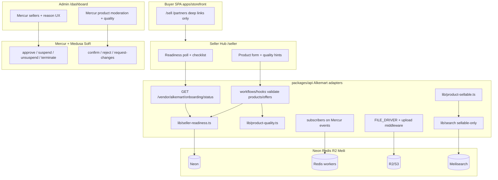
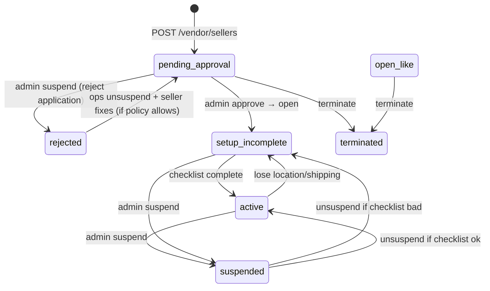
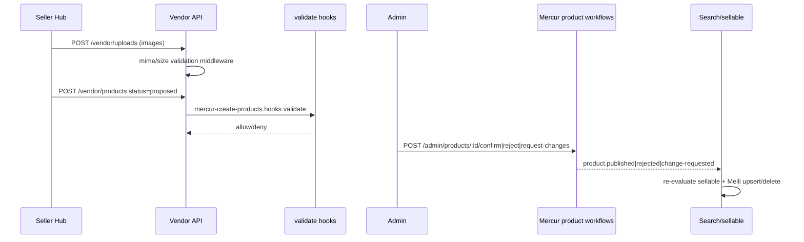
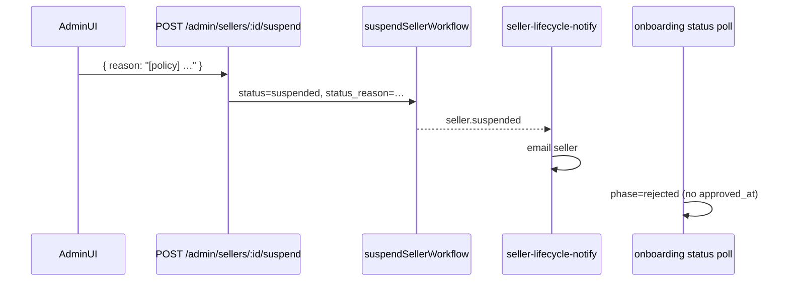
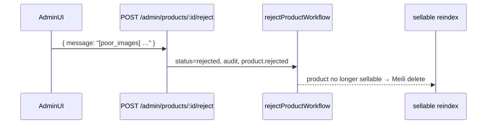

# Seller Onboarding + Quality Product Uploading Pipeline

| Field | Value |
|-------|--------|
| **Title** | Seller Onboarding + Quality Product Uploading Pipeline |
| **Author** | engineering |
| **Date** | 2026-07-18 |
| **Status** | Accepted for implementation (R2) — foundation landed on branch |
| **Codebase** | `/mnt/c/src/Alkemart4` |
| **Audience** | Senior engineers implementing marketplace readiness on Medusa + Mercur |
| **Primary surfaces** | `apps/backend` (API + Seller Hub + Admin); buyer SPA deep links only |
| **Related ADRs** | Clean-slate backend, Ops RBAC surfaces, Complete E2E procedures, Data/search/SEO Ghana plan, Commercial spine (boundary only) |
| **Verified against** | `@mercurjs/core@2.2.0`, `@mercurjs/types@2.2.0`, `@medusajs/file-s3@2.17.2` |

---

## Overview

Alkemart’s commerce path is proven as a multi-hop API runbook (member register → seller create → admin approve → product `proposed` → admin confirm → stock/shipping/offer/channel/`product_seller` links). What is missing is a **guided Ghana readiness experience**, **non-bypassable soft gates**, **durable media**, a **quality pre-check before moderation**, and a derived **sellable** predicate so discovery (Meilisearch / sitemap) matches add-to-cart reality.

This design specifies two systems as **thin Alkemart adapters** on Mercur—not a second commerce model and not Seller/Admin UIs rebuilt into `apps/storefront`:

1. **Realtime-ish seller onboarding** — readiness checklist layered on Mercur’s full seller lifecycle (`pending_approval` | `open` | `suspended` | `terminated`), guided Seller Hub steps, admin actions via **first-class Mercur routes**, soft gates via **workflow `validate` hooks**, status UX via **polling + email** (not WebSockets).

2. **Quality product uploading pipeline** — S3/R2 media with upload validation, quality score, Mercur product moderation (`confirm` / `reject` → `rejected` / `request-changes` while still `proposed`), derived **sellable**, Meilisearch + sitemap **only sellable**.

Money (Paystack MoMo, settlements, cancel compensation) remains the **commercial spine**. Onboarding/catalog quality only need clean boundaries—they do not invent payment state.

---

## Background & Motivation

### Current proven path (keep)

Documented in `docs/architecture/2026-07-16-mercur-vendor-rbac-catalog-runbook.md` and automated in `src/scripts/ensure-lab-commerce.ts`:

| Step | Mechanism |
|------|-----------|
| 1 | `POST /auth/member/emailpass/register` — **member** actor |
| 2 | `POST /vendor/sellers` → Mercur `status: pending_approval` immediately |
| 3 | Admin `POST /admin/sellers/:id/approve` → `open` (+ `approved_at`) |
| 4 | Vendor product `status: proposed` → admin confirm → `published` |
| 5 | Stock location + shipping + offer (GHS) + sales channel + `product_seller` |
| 6 | Store cart uses `offer_id` |

### Real gaps (corrected)

Mercur **already** owns seller suspend/terminate and product confirm/reject/request-changes. The production gaps are Ghana readiness UX and discovery quality—not inventing parallel lifecycle SoR.

| Gap | Evidence / impact |
|-----|-------------------|
| No guided GH readiness wizard | Sellers must know runbook order; setup incomplete shops can be `open` |
| No Alkemart soft gates on Mercur vendor create paths | Stock Seller Hub hits `/vendor/products` and `/vendor/offers` directly |
| Local file storage | `medusa-config.ts` uses `@medusajs/medusa/file-local` + `FILE_BACKEND_URL` |
| Manual product confirm without quality pre-check | No score, image rules, or structured reason_code catalog on top of Mercur `message` |
| Search indexes `status === "published"` only | `src/lib/search/service.ts` — non-ATC published products can appear in discovery |
| Buyer SPA correctly boundary-bound | `/sell`, `/partners` deep-link only |

### Binding product rules

- Sole commerce API: `apps/backend` = Medusa + Mercur
- Buyer SPA is **buyer only**
- Thin Alkemart adapters only — **do not fork Mercur**
- Prefer Mercur workflows/routes + metadata for Alkemart-only fields
- “Realtime” v1 = **state machines + poll + notifications**, not WebSockets

---

## Goals & Non-Goals

### Goals

1. Derive **seller readiness phase** from Mercur status + GH setup checklist.
2. Guided Seller Hub onboarding aligned with **create-then-approve-then-setup**.
3. Soft gates that **cannot be bypassed** by stock Seller Hub (workflow `validate` hooks).
4. Admin UX uses **Mercur seller/product lifecycle routes**; thin Alkemart extras only for reason_code catalog + queue filters + email.
5. S3/R2 media + validation on vendor uploads.
6. Quality score + propose gates; keep Mercur product statuses.
7. **Sellable** predicate; Meilisearch + sitemap only sellable.
8. Email on Mercur lifecycle events; poll 15–30s on onboarding screens.

### Non-Goals

| Non-goal | Why |
|----------|-----|
| Rebuild Seller Hub / Admin in buyer SPA | Ops RBAC ADR |
| WebSockets for onboarding | Poll + email enough |
| Bulk CSV import | P3 |
| Full KYC | Future compliance |
| Paystack settlements / MoMo async | Commercial spine |
| Forking `@mercurjs/*` | Extend via hooks/routes/subscribers/widgets |
| Auto-publish without admin confirm | Keep product request flow |
| Store list hard-filter to sellable in v1 | Search/sitemap first; store list accepted divergence (see KD-15) |

---

## Key Decisions

| # | Decision | Rationale |
|---|----------|-----------|
| **KD-1** | Layer Alkemart **readiness** on all four Mercur statuses: `pending_approval`, `open`, `suspended`, `terminated` | Verified in `@mercurjs/types` `SellerStatus`; model also has `status_reason`, `approved_at`, `rejected_at`, `closed_from`/`closed_to`, `closure_note` |
| **KD-2** | Lifecycle SoR = Mercur status fields; `metadata.alkemart` only for wizard progress, optional `reason_code`, notification stamps | Avoid double SoR; `status_reason` already exists |
| **KD-3** | **Reject pending seller** = Mercur **`POST /admin/sellers/:id/suspend`** with reason (not terminate, not metadata-only). UI label: “Reject application.” Reinstate = **`unsuspend`**. Permanent ban = **`terminate`** | Suspend is reversible and already sets `status_reason` / `rejected_at` path in Mercur; no first-class “reject pending” route exists |
| **KD-4** | Product statuses: Mercur/Medusa `draft \| proposed \| published \| rejected`. **Request-changes stays `proposed`** with audit + `product.change-requested` | Verified workflows: reject → `REJECTED`; request-changes does not demote status |
| **KD-5** | Admin product actions use Mercur routes (`confirm` / `reject` / `request-changes`); optional thin wrappers only for reason_code composition + email/reindex side effects | Do not invent parallel admin product APIs as primary |
| **KD-6** | Soft gates enforced via Mercur workflow **`validate` hooks** on `mercur-create-products` and `create-offers` (and update counterparts when present)—**not** UI-only wrappers | Stock Seller Hub calls raw `/vendor/products` and `/vendor/offers` |
| **KD-7** | Quality score stored as last snapshot in `product.metadata.alkemart.quality`; recompute on propose gate and admin view | Cheap pure function; snapshot helps UI without SoR claims |
| **KD-8** | Sellable ≠ published; search + sitemap hard-require sellable | Fixes false discovery |
| **KD-9** | File backend: `@medusajs/medusa/file-s3` → `@medusajs/file-s3@2.17.2`; R2 preferred with `acl: false` | Local only for single-node lab |
| **KD-10** | Realtime UX: poll 15–30s + email; no WebSockets v1 | Appropriate latency for approve flows |
| **KD-11** | UI in `apps/backend/apps/{vendor,admin}` only; storefront deep links only | Ops RBAC |
| **KD-12** | Notifications: subscribers on **Mercur events** → thin email adapter (greenfield; no SMTP module exists today) | Admin UI buttons fire Mercur events; wrappers alone would miss them |
| **KD-13** | `ALKEMART_REQUIRE_CATEGORY_ON_PROPOSE` default **`false`** until categories seeded and Seller Hub category assignment is usable (`categories` nav is currently `hidden: true`) | Avoid blocking propose on missing taxonomy |
| **KD-14** | Wizard order: **create shop → pending_approval immediately → wait admin approve → location/shipping setup → active**. Setup while pending is **not** required and not assumed (lab scripts approve first) | Matches Mercur `createSellerAccountWorkflow` + runbook |
| **KD-15** | v1 discovery SoT for “buyer can buy” is **search + sitemap sellable**. Store product list may still show published non-sellable until a later store middleware PR | Explicit accepted divergence; document in risk register |
| **KD-16** | Image derivatives: **async job** with `sharp` after upload succeeds; sync path only validates mime/size/magic bytes | Avoid upload timeouts |
| **KD-17** | Offer amount units = **major GHS units** as in runbook (`45` = GH₵45)—quality price sanity uses same units | Cite runbook / Mercur offer prices |

---

## Proposed Design

### Architecture (high level)



---

### A. Seller onboarding (realtime-ish)

#### A.1 Layer 1 — Mercur seller lifecycle (SoR)

Verified `@mercurjs/types` `SellerStatus` and seller model:

| Mercur `status` | Meaning | Primary admin route |
|-----------------|---------|---------------------|
| `pending_approval` | Shop created; awaiting platform decision | (initial create) |
| `open` | Approved; may complete setup and sell when checklist OK | `POST /admin/sellers/:id/approve` |
| `suspended` | Ops blocked (includes **reject application** mapping) | `POST /admin/sellers/:id/suspend` body `{ reason }` |
| `terminated` | Permanent close | `POST /admin/sellers/:id/terminate` |

Also on model: `status_reason`, `approved_at`, `rejected_at`, `closed_from`, `closed_to`, `closure_note`, `metadata`.

Events (`SellerWorkflowEvents` in `workflows/events.js`):

- `seller.created`, `seller.updated`, `seller.deleted`
- `seller.approved`, `seller.suspended`, `seller.unsuspended`
- `seller.terminated`, `seller.unterminated`

**Do not** re-implement approve/suspend/unsuspend/terminate as Alkemart-owned lifecycle SoR.

#### A.2 Reject-pending decision (closes Q1)

| Product language | Mercur action | Reversible? |
|------------------|---------------|-------------|
| **Reject application** (pending seller not good enough) | `POST /admin/sellers/:id/suspend` with `reason` string composed as `[code] human text` | Yes → `unsuspend` then re-review / re-approve path as Mercur allows |
| **Suspend active seller** | same `suspend` | Yes → `unsuspend` |
| **Permanently ban** | `terminate` | `unterminate` exists but treat as rare ops |

**Optional reason_code** (Alkemart catalog) stored in `metadata.alkemart.reason_code` **in addition to** Mercur `status_reason` (full human message). Lifecycle truth remains Mercur `status`.

Reason codes (v1):

| Code | Default text for `status_reason` |
|------|----------------------------------|
| `incomplete_profile` | Shop profile is incomplete or unclear |
| `invalid_address` | Ghana business address needs correction |
| `policy` | Does not meet marketplace selling policy |
| `duplicate` | Appears to duplicate an existing shop |
| `other` | Free-text required |

#### A.3 Layer 2 — Alkemart readiness (derived)

```ts
// seller.metadata.alkemart — non-lifecycle only
type AlkemartSellerMeta = {
  onboarding: {
    last_step?: "profile" | "waiting_approval" | "stock_location" | "shipping" | "done"
  }
  reason_code?: string // optional structured code; status_reason is SoR text
  notifications?: { last_email_at?: string; last_email_event?: string }
}
```

**Derived phase** (API computes; never a second status column):

| Phase | Rule |
|-------|------|
| `pending_approval` | `status === pending_approval` |
| `rejected` | `status === suspended` **and** never had `approved_at` (application rejected before go-live) |
| `setup_incomplete` | `status === open` AND checklist incomplete |
| `active` | `status === open` AND checklist complete |
| `suspended` | `status === suspended` AND `approved_at` set (was live) |
| `terminated` | `status === terminated` |



#### A.4 Soft-gate checklist (Ghana v1)

Setup-complete when all true:

| Check | Evaluation (see Implementation Appendix for graph fields) |
|-------|-----------------------------------------------------------|
| `status === open` | seller.status |
| Profile min | name, handle, email, `currency_code=ghs`, address country `gh` + city + address_1 |
| ≥1 stock location for seller | stock_location linked to seller |
| Location ↔ default sales channel | stock location sales channel link includes storefront SC |
| ≥1 shipping profile | seller shipping profile |
| ≥1 GH shipping option | shipping option on seller fulfillment path covering country `gh` (service zone geo / country codes) |
| Not suspended/terminated | status |

**Not required for setup-complete:** products, Paystack subaccount, KYC.

#### A.5 Soft gate enforcement (non-bypassable)

**SoR for gates = workflow hooks**, not optional Alkemart propose endpoints.

| Gate | When | Mechanism |
|------|------|-----------|
| Block `status=proposed` product create/update | Seller not `open`, or suspended/terminated, or (if `ALKEMART_STRICT_PROPOSE_GATES`) setup incomplete, or quality blocking | Hook on `mercur-create-products` `validate`; also product update workflow if/when Mercur exposes equivalent validate hook — otherwise middleware on vendor product update as backup |
| Block offer create/update | Seller not setup-complete | Hook on `create-offers` / `update-offers` `validate` |
| Drafts | Always allowed when seller membership valid | No quality gate on draft |

**Subscribers after the fact are not sufficient for strict mode.**

Files (Alkemart-owned):

```text
apps/backend/packages/api/src/workflows/hooks/validate-product-create.ts
apps/backend/packages/api/src/workflows/hooks/validate-offer-create.ts
apps/backend/packages/api/src/workflows/hooks/validate-offer-update.ts
```

Registration pattern (Medusa workflow hooks — first implementation in this repo; no existing hooks folder):

```ts
// Example — use framework API for this Medusa version
import { createProductsWorkflow } from "@mercurjs/core/workflows"
// mercur-create-products exports createProductsWorkflow with hooks.validate

createProductsWorkflow.hooks.validate(async ({ input, products }, { container }) => {
  // throw MedusaError if any product status is proposed and gates fail
})
```

Flag: `ALKEMART_STRICT_PROPOSE_GATES` (default `true` in staging/prod, readable **inside hooks**). When `false`, hooks no-op for quality/setup (still may block suspended/terminated).

Optional UX convenience: `POST /vendor/alkemart/products/:id/propose` — **not** the only gate.

#### A.6 Guided multi-step flow (Seller Hub)

**Host:** `apps/backend/apps/vendor` only.

**Wizard order (KD-14):**

| Step | Seller action | Phase |
|------|---------------|-------|
| 1 Register member + create shop | `POST /vendor/sellers` | → `pending_approval` immediately |
| 2 Wait for approval | Poll status; read-only checklist | `pending_approval` or `rejected` |
| 3 Stock location + SC link | After `open` | `setup_incomplete` |
| 4 Shipping profile + GH option | After `open` | `setup_incomplete` → `active` |
| 5 First product CTA | When `active` | list catalog |

There is **no** separate “submit for approval” after create — create already pending. Drop any `submit-review` concept as a lifecycle action; optional stamp of `last_step` only.

UI:

- Upgrade `widgets/seller-setup-banner.tsx` (`zone: "seller.setup.before"`) to readiness panel
- Optional `routes/onboarding/page.tsx`
- Navigation pin “Get ready to sell” while phase ≠ `active`
- Custom fields for GH address if needed (`zone: "onboarding"` tabs)

#### A.7 Admin seller UX

**Primary:** Mercur Admin sellers + existing routes:

- Approve: `POST /admin/sellers/:id/approve`
- Reject application / suspend: `POST /admin/sellers/:id/suspend` `{ reason }`
- Unsuspend: `POST /admin/sellers/:id/unsuspend`
- Terminate / unterminate as rare ops

**Alkemart thin layer (optional):**

- Admin custom route/widget: queue filters + reason_code dropdown that composes `reason` = `[code] text` and optionally patches `metadata.alkemart.reason_code`
- **No** `POST /admin/alkemart/sellers/:id/reject|suspend|reinstate` as lifecycle SoR

#### A.8 Readiness API (polling)

```text
GET /vendor/alkemart/onboarding/status
Auth: Mercur /vendor/* stack (authenticate member + ensureSellerMiddleware)
  — do NOT set AUTHENTICATE=false
  — prefer req.seller_context.seller_id; do not trust raw header alone as security model
Poll: 15–30s on onboarding screens; stop when phase=active
```

Response:

```json
{
  "seller_id": "sel_…",
  "mercur_status": "open",
  "status_reason": null,
  "approved_at": "2026-07-16T…",
  "phase": "setup_incomplete",
  "checklist": {
    "profile": true,
    "stock_location": true,
    "sales_channel_link": false,
    "shipping_profile": true,
    "gh_shipping_option": false
  },
  "setup_complete": false,
  "can_propose_products": false,
  "can_create_offers": false,
  "reason_code": null,
  "next_action": {
    "code": "link_sales_channel",
    "label": "Link your stock location to the storefront sales channel"
  },
  "poll_after_seconds": 20
}
```

Route: `src/api/vendor/alkemart/onboarding/status/route.ts`  
Lib: `src/lib/seller-readiness.ts`  
App middleware: optional `authenticate("member")` like stats, but **security depends on Mercur ensureSeller** remaining on `/vendor/*`.

#### A.9 Notifications

See § Notifications (Mercur event map). Prefer subscribers on Mercur events over Alkemart-only emit paths.

#### A.10 Buyer SPA

Keep `sell.tsx` / `partners.tsx` deep links only. No member JWT in storefront. No seller progress UI in buyer SPA for v1.

---

### B. Quality product uploading pipeline



#### B.1 Mercur product request flow (canonical)

| Status / action | Owner | Result |
|-----------------|-------|--------|
| `draft` | Seller | Editable local |
| `proposed` | Seller submit | Awaiting admin |
| `POST …/confirm` | Admin | → `published` (`product.published`) |
| `POST …/reject` `{ message }` | Admin | → **`rejected`** (not draft); audit + `product.rejected` |
| `POST …/request-changes` `{ message }` | Admin | Status **stays `proposed`**; audit CHANGE_REQUESTED + `product.change-requested` |
| Seller re-edit after reject | Seller | Mercur product-edit / create new as supported; do not invent draft demotion |

Optional metadata:

```ts
product.metadata.alkemart = {
  quality?: { score, band, computed_at, checks },
  reason_code?: string // alongside Mercur message
}
```

**Do not** use `moderation.state` as parallel SoR.

#### B.2 Media pipeline (concrete)

**Provider resolve:** `@medusajs/medusa/file-s3` re-exports `@medusajs/file-s3` (`discoveryPath` → file-s3). Use resolve `@medusajs/medusa/file-s3` consistent with file-local pattern in `medusa-config.ts`.

```ts
// medusa-config.ts — branch on FILE_DRIVER
const fileProvider =
  process.env.FILE_DRIVER === "s3"
    ? {
        resolve: "@medusajs/medusa/file-s3",
        id: "s3",
        options: {
          file_url: process.env.S3_FILE_URL, // public CDN base, no trailing slash issues
          access_key_id: process.env.S3_ACCESS_KEY_ID,
          secret_access_key: process.env.S3_SECRET_ACCESS_KEY,
          region: process.env.S3_REGION || "auto",
          bucket: process.env.S3_BUCKET,
          endpoint: process.env.S3_ENDPOINT, // R2: https://<accountid>.r2.cloudflarestorage.com
          prefix: process.env.S3_PREFIX || "alkemart/",
          // R2 / BucketOwnerEnforced: omit ACL header
          acl: false,
          additional_client_config: {
            forcePathStyle: true,
          },
        },
      }
    : {
        resolve: "@medusajs/medusa/file-local",
        id: "local",
        options: {
          backend_url:
            process.env.FILE_BACKEND_URL || "http://localhost:9000/static",
        },
      }
```

**Env (`loadAppEnv` production rules):**

| Variable | Lab | Production |
|----------|-----|------------|
| `FILE_DRIVER` | `local` default | **required `s3`** — fail boot if `local` |
| `S3_FILE_URL` | optional | required public base (custom domain or R2 public URL) |
| `S3_ENDPOINT` | optional | required for R2 |
| `S3_BUCKET` | optional | required |
| `S3_ACCESS_KEY_ID` / `S3_SECRET_ACCESS_KEY` | optional | required if access-key auth |
| `S3_REGION` | `auto` | `auto` OK for R2 |
| `S3_PREFIX` | `alkemart/` | recommended |
| `FILE_BACKEND_URL` | local only | ignored when s3 |

**R2 checklist:** public access via custom domain or R2.dev URL = `S3_FILE_URL`; Object Ownership BucketOwnerEnforced → `acl: false`; CORS on bucket if browser PUT to presigned URLs (v1 uses server `POST /vendor/uploads` so CORS may only need admin/seller origins for API).

**Upload path:** Mercur `POST /vendor/uploads` (multer → `uploadFilesWorkflow`). Alkemart adds **app middleware** matcher on `/vendor/uploads` that:

1. Rejects empty
2. MIME allow-list: `image/jpeg`, `image/png`, `image/webp`
3. Max 5 MiB per file
4. Magic-byte sniff (not just Content-Type)
5. Optional: decode dimensions with `image-size` / `sharp` metadata — min 600×600 for files that will become primary (or all uploads v1)

On failure: **400 before** workflow upload (no orphan objects).

**Derivatives (async):**

| Item | Spec |
|------|------|
| Job | `src/jobs/process-product-images.ts` or subscriber on product update when images change |
| Library | `sharp` |
| Outputs | `{prefix}derivatives/{id}-thumb.webp` (≤400px), `{id}-lg.webp` (≤1600px) |
| Idempotency | key by source file URL hash; skip if derivative metadata present |
| product.thumbnail | set to thumb URL when primary image processed |
| Failure | log error; leave original; do not block publish |

**Migration policy (lab → S3):**

- **No automatic rewrite** of historical `localhost:9000/static` URLs in product rows.
- Lab/demo: re-run `ensure-lab-commerce` / re-upload images after cutover, **or** one-shot script `src/scripts/migrate-local-files-to-s3.ts` that downloads local paths and re-uploads (best-effort; skip missing files).
- Prod: start clean on S3; do not promote local URL catalogs.

#### B.3 Quality score

Pure function `src/lib/product-quality.ts`. Units for price = **major GHS** (runbook offer `amount: 45`).

| Check | Points | Scoring threshold | Blocking for propose (when strict) |
|-------|--------|-------------------|-------------------------------------|
| Title length | 15 | 12–80 chars | title trimmed length &lt; 8 |
| Description | 20 | ≥ 80 chars | description &lt; 20 chars |
| Image count | 20 | ≥ 2 | zero images |
| Primary image dims | 15 | ≥ 600×600 if known | — (upload already enforces when dims known) |
| Category assigned | 15 | ≥1 category | only if `ALKEMART_REQUIRE_CATEGORY_ON_PROPOSE=true` |
| Price sanity (when offer exists) | 15 | 0.5 ≤ amount ≤ 500_000 GHS major | amount &lt; 0.5 or &gt; 500_000 |

Bands: poor &lt;40, fair 40–59, good 60–79, excellent ≥80.  
Block propose if any blocking rule fails **or** score &lt; 40 when strict.  
Fair (40–59) allows propose with warning for admin.

**Category flag default false** until admin seeds Ghana categories and product form exposes assignment (nav currently hides `categories` in vendor `_navigation.ts`).

#### B.4 Admin product moderation UX

Primary Mercur:

```text
POST /admin/products/:id/confirm
POST /admin/products/:id/reject          body: { message }
POST /admin/products/:id/request-changes body: { message }
```

Admin Alkemart UI (custom route like `routes/product-moderation/page.tsx` patterned on `routes/markets`):

- List `proposed` products + quality snapshot
- Actions call Mercur endpoints; compose `message` = `[reason_code] text`
- Optionally PATCH metadata reason_code

No lifecycle-owned Alkemart reject that sets draft.

#### B.5 Sellable predicate (concrete)

```ts
// src/lib/product-sellable.ts
export type SellableResult = { sellable: boolean; reasons: string[]; in_stock: boolean }

// Dependency order: seller-readiness (no import of search) → sellable → search
```

| Clause | Graph / data | Fail reason code |
|--------|--------------|------------------|
| Product published | `product.status === "published"` | `not_published` |
| product_seller link | `product_seller` or product `seller` relation with seller id | `no_product_seller` |
| Seller active readiness | `evaluateSellerReadiness(seller).phase === "active"` | `seller_not_active` |
| Sales channel | product sales_channels includes storefront SC id (env/config) | `no_sales_channel` |
| GHS offer | offer for product with `prices` containing `currency_code` ghs, amount &gt; 0 | `no_ghs_offer` |
| Shipping profile on offer | `offer.shipping_profile_id` set | `no_shipping_profile` |
| Stock ≥ 1 | sum inventory levels for offer inventory items ≥ 1 when `ALKEMART_SELLABLE_REQUIRES_STOCK=true` (default true) | `out_of_stock` |

**Graph field sketch** (implementers adjust if entity names differ—pattern from `ensure-lab-commerce.ts` + `commerce-stats.ts` + search `PRODUCT_FIELDS` / `OFFER_FIELDS`):

```ts
// product
fields: [
  "id", "status", "handle", "title", "thumbnail", "metadata",
  "categories.id",
  "sales_channels.id",
  "seller.id", "seller.status", "seller.approved_at", "seller.currency_code",
  // if seller nested unavailable, resolve product_seller link entity
]
// offer
fields: [
  "id", "product_id", "variant_id", "seller_id", "shipping_profile_id",
  "prices.amount", "prices.currency_code",
  "inventory_items.id", // or linked inventory via offer inventory links
]
// inventory level
fields: ["inventory_item_id", "location_id", "stocked_quantity"]
// stock location + SC: reuse readiness checklist helpers
```

**GH shipping detection (readiness):** list seller shipping options / service zones; pass if any zone includes country code `gh` (or region GH) — same structure `ensure-lab-commerce` creates (fulfillment set + service zone + shipping option).

#### B.6 Search + sitemap + events

**Meilisearch document extensions** (`types.ts`):

```ts
sellable: boolean
in_stock: boolean
quality_score: number | null
```

**`ensureProductsIndex` settings** — add to filterable + displayed: `sellable`, `in_stock`, `quality_score`.

**`upsertProductDocuments`:** keep only `sellable === true`; delete ids that are not sellable.

**`searchProducts` filter:** always `sellable = true` (replace reliance on published-only).

**Sitemap hard rule:** `listPublishedSitemapEntries` → rename/behavior `listSellableSitemapEntries`: only sellable products. Update `src/api/store/sitemap/route.ts` consumers accordingly.

**Event / subscriber matrix (latency target p95 &lt; 1s for single-id reindex when Meili up):**

| Event | Subscriber action |
|-------|-------------------|
| `product.created`, `product.updated` | re-eval sellable + upsert/delete |
| `product.published`, `product.rejected` | same |
| `offer.created`, `offer.updated`, `offer.deleted` | resolve product_id → re-eval |
| `seller.approved`, `seller.suspended`, `seller.unsuspended`, `seller.terminated`, `seller.unterminated` | re-eval all seller products (batch) |
| inventory level changes | if event available; else 15m job covers |

Job safety net: `src/jobs/recompute-sellable-search.ts` every 15m (not hourly primary).

**Store list divergence (KD-15):** accepted in v1 that `GET /store/products` may return published non-sellable; search and sitemap will not. Follow-up PR may add store filter middleware.

#### B.7 Seller product UX

Quality checklist + moderation messages (from Mercur reject/request-changes `message` + optional reason_code). Propose goes through stock Hub → hooks enforce gates.

Bulk CSV: P3.

---

### C. Implementation constraints & file map

| Concern | Path |
|---------|------|
| Config / file provider | `packages/api/medusa-config.ts` |
| Env validation | `src/lib/env.ts` |
| Seller readiness | `src/lib/seller-readiness.ts` |
| Product quality | `src/lib/product-quality.ts` |
| Sellable | `src/lib/product-sellable.ts` |
| Media validation | `src/lib/media/validate-image.ts` + middleware |
| Email adapter | `src/lib/email.ts` (greenfield) |
| Workflow hooks | `src/workflows/hooks/*` |
| Onboarding status | `src/api/vendor/alkemart/onboarding/status/route.ts` |
| Upload middleware | `src/api/middlewares.ts` matcher `/vendor/uploads` |
| Search | `src/lib/search/*` |
| Subscribers | `src/subscribers/search-*`, `src/subscribers/*-notify.ts` |
| Jobs | `src/jobs/process-product-images.ts`, `recompute-sellable-search.ts` |
| Vendor UI | `apps/vendor/src/{widgets,routes}` |
| Admin UI | `apps/admin/src/routes/*` (markets/analytics pattern) |
| Buyer | `storefront` sell/partners only |
| Lab scripts | update `ensure-lab-commerce.ts` comments/checks if needed |

**Auth stack for `/vendor/alkemart/*`:**

1. Mercur `vendorMiddlewares`: member authenticate + **`ensureSellerMiddleware`** for `/vendor/*` (except allowlisted routes like `POST /vendor/sellers`).
2. App `middlewares.ts` may add extra authenticate for clarity.
3. **Never** `AUTHENTICATE=false` on onboarding routes.
4. Prefer `req.seller_context.seller_id`. Stats route’s header fallback is **not** a model to copy for security design if ensureSeller is skipped.

---

## API / Interface Changes

### New Alkemart routes (thin)

| Method | Path | Auth | Purpose |
|--------|------|------|---------|
| GET | `/vendor/alkemart/onboarding/status` | member + ensureSeller | Checklist + phase poll |
| GET | `/vendor/alkemart/products/:id/quality` | member + ensureSeller | Quality breakdown |

Optional convenience (not sole gate):

| POST | `/vendor/alkemart/products/:id/propose` | member + ensureSeller | Sets proposed after client-side checks; hooks still enforce |

### Mercur routes used as-is (canonical)

**Sellers:** approve, suspend, unsuspend, terminate, unterminate  
**Products:** confirm, reject, request-changes  
**Vendor:** products, offers, stock-locations, shipping-*, uploads  

### Explicitly **not** building as lifecycle SoR

- `POST /admin/alkemart/sellers/:id/reject|suspend|reinstate`
- `POST /admin/alkemart/products/:id/reject` that demotes to draft
- Parallel `moderation.state` machine

### Zod sketches for Alkemart-only bodies

```ts
// Optional admin widget helper (if we add a compose endpoint — prefer client-side compose)
const SuspendReasonCompose = z.object({
  reason_code: z.enum(["incomplete_profile","invalid_address","policy","duplicate","other"]),
  reason_text: z.string().max(500).optional(),
})
// Client sends to Mercur: { reason: `[${code}] ${text}` }
```

---

## Data Model Changes

- No new commerce tables v1.
- Seller/product metadata.alkemart additive JSON only.
- Meilisearch settings update + full reindex on deploy of sellable fields.
- File objects in R2 under `S3_PREFIX`.

---

## Alternatives Considered

### Soft-gate enforcement

| Option | Pros | Cons | Verdict |
|--------|------|------|---------|
| Workflow `validate` hooks | Runs on stock Hub paths; non-bypassable | First hooks in this repo | **Chosen** |
| Route middleware only on Alkemart wrappers | Simple | Bypassed by `/vendor/products` | Reject |
| UI-only | Fast | Not a gate | Reject |
| Post-create subscribers demote | Soft cleanup | Race; bad UX; not strict | Reject for strict mode |

### Reject pending seller

| Option | Pros | Cons | Verdict |
|--------|------|------|---------|
| `suspend` + reason | First-class API, reversible, status_reason | UI must distinguish rejected-vs-suspended-active via `approved_at` | **Chosen** |
| `terminate` | Strong finality | Harsh for application reject; harder re-onboard | Permanent ban only |
| Metadata-only while pending | — | Double SoR; gates miss | Reject |

### Admin product moderation surface

| Option | Pros | Cons | Verdict |
|--------|------|------|---------|
| Thin Admin UI over Mercur routes | Aligns audit/events | Less custom API | **Chosen** |
| New Alkemart product reject APIs as primary | Custom shape | Fights Mercur statuses | Reject as primary |

### Quality score storage

| Option | Pros | Cons | Verdict |
|--------|------|------|---------|
| Ephemeral only | Always fresh | Extra compute on list | OK for score alone |
| Snapshot in metadata | Fast admin list | Stale if not refreshed | **Chosen hybrid**: recompute on gate; snapshot for UI |

### Image processing

| Option | Pros | Cons | Verdict |
|--------|------|------|---------|
| Sync on upload | Immediate thumb | Timeouts, sharp load on request path | Reject for derivatives |
| Async job | Scalable | Brief missing thumb | **Chosen** |
| Validate sync only | Fast fail bad files | — | **Chosen for validation** |

### Sellable enforcement surface

| Option | Pros | Cons | Verdict |
|--------|------|------|---------|
| Search + sitemap only | Ship discovery honesty fast | Store list may diverge | **v1 chosen** |
| Also store list middleware | Consistent | More invasive; risk over-filter | Follow-up |

### Notifications transport

| Option | Pros | Cons | Verdict |
|--------|------|------|---------|
| Raw SMTP/API adapter `lib/email.ts` | Ship fast; no module | Manual | **v1** |
| Medusa notification module | Framework-native | More setup | Later if multi-channel |

---

## Security & Privacy

| Risk | Severity | Mitigation |
|------|----------|------------|
| Seller cross-tenant | High | Mercur `ensureSellerMiddleware` on `/vendor/*`; never AUTHENTICATE=false on onboarding |
| Trusting only `x-seller-id` | High | Prefer `seller_context`; membership from ensureSeller |
| Malicious uploads | High | Middleware validation before upload workflow; mime magic; size limit; no SVG |
| Local files multi-instance | High | Prod `FILE_DRIVER=s3` fail-fast |
| PII in email | Medium | Shop name + deep link; no full address dumps |
| Search draft leak | Medium | sellable-only index + delete |

---

## Observability

**Log field conventions (v1 metrics = structured logs):**

```text
event=seller_readiness seller_id=… phase=… setup_complete=bool
event=soft_gate_denied seller_id=… gate=propose|offer code=…
event=moderation_side_effect product_id=… mercur_event=product.rejected
event=image_validation_failed code=image_mime|image_too_large|…
event=sellable_reindex product_id=… sellable=bool duration_ms=…
event=email_failed mercur_event=… error=…
```

Flag read sites for gates: workflow hooks only (mandatory).  
Jobs run in Medusa worker process (same API deploy with Redis); document `bunx medusa start` / worker expectations in runbook update PR.

---

## Notifications (Mercur event map)

| Mercur event | Template | Recipient |
|--------------|----------|-----------|
| `seller.approved` | Application approved — complete setup | `seller.email` |
| `seller.suspended` | Suspended / application rejected + `status_reason` | `seller.email` |
| `seller.unsuspended` | Account reinstated | `seller.email` |
| `seller.terminated` | Account terminated | `seller.email` |
| `product.published` | Product live (may still be non-sellable until offer) | seller of product |
| `product.rejected` | Rejected + message | seller |
| `product.change-requested` | Changes requested + message | seller |

Implementation: `src/subscribers/seller-lifecycle-notify.ts`, `product-moderation-notify.ts` → `src/lib/email.ts`.  
Stamp `metadata.alkemart.notifications`. No SMS v1.

---

## Rollout Plan

### Feature flag matrix

| Flag | Default lab | Default prod | Read site |
|------|-------------|--------------|-----------|
| `FILE_DRIVER` | `local` | `s3` (boot fail otherwise) | medusa-config, env.ts |
| `ALKEMART_STRICT_PROPOSE_GATES` | `false` optional | `true` | workflow hooks |
| `ALKEMART_REQUIRE_CATEGORY_ON_PROPOSE` | `false` | `false` until taxonomy | quality + hooks |
| `ALKEMART_SELLABLE_REQUIRES_STOCK` | `true` | `true` | sellable lib |
| `MEILISEARCH_HOST` | unset | set | search client |

### Acceptance tests (flags)

- Strict on + setup incomplete → create product proposed → 400 from hook
- Strict off → proposed allowed (still block suspended)
- FILE_DRIVER=local in NODE_ENV=production → process refuses start
- Sellable false → not in Meili after sync; not in sitemap

### Stages

1. Lab: readiness API + hooks (strict off) + local files  
2. Staging: S3 + strict on + email + reindex  
3. Prod: fail-fast env + monitor logs  

### Rollback

- Soft gates: `ALKEMART_STRICT_PROPOSE_GATES=false` (hooks no-op setup/quality)
- Search: reindex with temporary published filter only if emergency (document)
- S3: do not flip prod to local multi-instance

### Worker expectation

Redis required (`env.ts`). Image derivative + sellable recompute jobs need the Medusa server/worker that loads `src/jobs`. Single API process OK at Ghana launch volume if jobs scheduled in-process.

---

## Open Questions

| # | Question | Status |
|---|----------|--------|
| Q1 | Reject pending mapping | **Closed: suspend** (KD-3) |
| Q2 | Email provider | Prefer Resend/Postmark API or SMTP — ops picks keys; adapter interface stable |
| Q3 | Setup while pending allowed by Mercur? | **Assume no for wizard**; gates require `open` for propose/offers. Spike only if product wants pre-approve catalog prep beyond drafts |
| Q4 | Category taxonomy seed date | Flag stays false until seed PR |
| Q5 | R2 vs AWS | Prefer R2 if Cloudflare path exists; config identical |
| Q6 | Moderation SLA | Not enforced in code |

---

## Implementation Appendix

### Sequence: admin rejects pending seller



### Sequence: admin rejects product



### Hook registration note

This codebase has no existing `src/workflows/hooks` implementations—only README. First PR that adds hooks should verify Medusa 2.17 / Mercur workflow hook export (`createProductsWorkflow.hooks.validate`) against running container and add a unit/integration test that proposed create fails when seller suspended.

### Test plan

| Layer | Coverage |
|-------|----------|
| Unit | quality score table; sellable pure decisions with fixtures; image mime/size |
| Unit | readiness phase matrix (pending, rejected via suspend w/o approved_at, active, suspended-after-approve, terminated) |
| Integration | lab seller via `ensure-lab-commerce`; proposed product blocked when setup incomplete (strict on) |
| Integration | confirm product + offer + stock → sellable true → search upsert |
| Integration | suspend seller → products removed from index |
| Manual | Seller Hub poll UI; Admin Mercur buttons still work |

### Admin UI approach

Custom routes under `apps/admin/src/routes/` (same pattern as `markets/`, `analytics/`) for queues that need quality columns; widgets for banners on existing seller/product detail if zones exist. Prefer composing Mercur SDK client calls to stock endpoints.

---

## Risks

| Risk | Severity | Mitigation |
|------|----------|------------|
| Phase `rejected` heuristic (`suspended` without `approved_at`) mislabels suspended-before-approve edge cases | Low | Document; optional reason_code |
| Product update path bypasses create hook | Medium | Add update validate hook or vendor product middleware backup |
| Store list vs search divergence confuses QA | Medium | KD-15; QA scripts use search |
| Hook API version drift | Medium | Pin test on create proposed while suspended |
| Email greenfield deliverability | Medium | Staging with real provider before prod |

---

## References

| Doc / code | Relevance |
|------------|-----------|
| `@mercurjs/types` `SellerStatus` | Four statuses |
| `@mercurjs/core` admin sellers `approve|suspend|unsuspend|terminate` | Lifecycle SoR |
| `@mercurjs/core` admin products `confirm|reject|request-changes` | Product moderation SoR |
| `workflows/events.js` SellerWorkflowEvents, OfferWorkflowEvents | Notification + search |
| `workflows/product/events.js` | product.published/rejected/change-requested |
| `mercur-create-products` / `create-offers` `validate` hooks | Soft gates |
| `api/vendor/middlewares.js` ensureSeller | Auth |
| `api/vendor/uploads` | Media entry |
| `@medusajs/file-s3` options | S3/R2 |
| Runbook, clean-slate, ops RBAC, E2E, search Ghana plan, commercial spine | ADRs |
| `src/lib/search/*`, `medusa-config.ts`, `ensure-lab-commerce.ts` | In-repo anchors |

---

## PR Plan

Ordered, independently reviewable PRs. Each has acceptance checks.

### PR1 — Seller readiness lib + onboarding status API

- **Title:** `feat(api): seller readiness checklist and GET onboarding/status`
- **Affects:** `src/lib/seller-readiness.ts`, `src/api/vendor/alkemart/onboarding/status/route.ts`, `middlewares.ts` (member auth; **no** AUTHENTICATE=false), unit tests phase matrix
- **Depends on:** none
- **Description:** Derive phase from Mercur four statuses + checklist; map rejected = suspended without approved_at. No lifecycle write routes.
- **Accept:** status payload for lab open seller; suspended pending → phase rejected

### PR2 — Workflow-hook soft gates (products + offers)

- **Title:** `feat(api): validate hooks for proposed products and offers`
- **Affects:** `src/workflows/hooks/validate-*.ts`, flag `ALKEMART_STRICT_PROPOSE_GATES`, readiness import
- **Depends on:** PR1
- **Description:** Non-bypassable gates on mercur-create-products + create/update-offers. Subscribers are not the gate.
- **Accept:** strict on + incomplete setup → proposed create fails; draft ok; suspended seller cannot propose

### PR3 — S3/R2 file driver + `/vendor/uploads` validation + env fail-fast

- **Title:** `feat(api): FILE_DRIVER s3/R2 and upload validation middleware`
- **Affects:** `medusa-config.ts`, `src/lib/env.ts`, `src/lib/media/validate-image.ts`, `middlewares.ts`, `.env.template`, optional migrate script stub
- **Depends on:** none (parallel)
- **Description:** Branch file provider; prod requires s3 + keys; validate mime/size before uploadFilesWorkflow; document R2 `acl: false`; migration = re-upload / best-effort script
- **Accept:** boot fails prod+local; oversized PNG rejected; s3 config loads

### PR4 — Product quality lib + hook integration

- **Title:** `feat(api): product quality score and propose blocking rules`
- **Affects:** `src/lib/product-quality.ts`, hooks from PR2, optional `GET …/products/:id/quality`, flag category default **false**
- **Depends on:** PR2, PR3 preferred for image dims
- **Description:** Score table; blocking rules; major GHS units; metadata snapshot
- **Accept:** score&lt;40 blocks proposed; category not required by default

### PR5 — Admin UI: Mercur lifecycle + reason_code compose (sellers + products)

- **Title:** `feat(admin): seller and product moderation queues using Mercur APIs`
- **Affects:** `apps/admin/src/routes/sellers-queue/*`, `product-moderation/*`, reason dropdown composing Mercur `reason`/`message`
- **Depends on:** PR1 (readiness display optional), PR4 (quality column)
- **Description:** **No** Alkemart lifecycle SoR routes. Approve/suspend/confirm/reject/request-changes = Mercur.
- **Accept:** reject pending uses suspend; product reject → status rejected in API

### PR6 — Seller Hub readiness panel (poll)

- **Title:** `feat(vendor): readiness checklist polling UI`
- **Affects:** `seller-setup-banner.tsx`, optional onboarding route, i18n
- **Depends on:** PR1
- **Description:** 20s poll; wizard copy matches create→wait→setup order
- **Accept:** pending shows waiting; after approve shows location/shipping next actions

### PR7 — Sellable predicate + Meili sellable-only + sitemap + event subscribers

- **Title:** `feat(search): sellable evaluation, index, sitemap, multi-event sync`
- **Affects:** `product-sellable.ts`, `lib/search/*` (types, client settings, service), `listSellableSitemapEntries`, subscribers for product/offer/seller events, `jobs/recompute-sellable-search.ts` (15m)
- **Depends on:** PR1
- **Description:** Hard sellable rules; Meili filterable `sellable`/`in_stock`/`quality_score`; store list divergence documented
- **Accept:** published without offer not indexed; seller suspend removes docs; sitemap excludes non-sellable

### PR8 — Email adapter + Mercur event subscribers

- **Title:** `feat(api): email notifications on seller and product Mercur events`
- **Affects:** `src/lib/email.ts`, `src/subscribers/*-notify.ts`, env SMTP/API keys
- **Depends on:** none strictly; best after PR5 so ops path real (can land parallel with UI)
- **Description:** Map seller.* and product.rejected|published|change-requested; no custom-only emit
- **Accept:** suspend fires email path in test double

### PR9 — Image derivative job + seller quality UX polish

- **Title:** `feat(vendor+api): async image derivatives and product quality UI`
- **Affects:** `jobs/process-product-images.ts`, vendor product widgets/custom-fields, minor storefront sell copy if needed
- **Depends on:** PR3, PR4, PR6
- **Description:** sharp thumbs; show quality + Mercur messages in Hub
- **Accept:** upload produces derivative eventually; reject message visible

### PR10 — Staging hardening, lab scripts, runbook

- **Title:** `docs+chore: onboarding/quality runbook, flag matrix tests, lab script notes`
- **Affects:** architecture runbook update, `ensure-lab-commerce` comments, integration tests, DEPLOYMENT notes for worker/S3
- **Depends on:** PR2, PR3, PR7, PR8
- **Description:** End-to-end acceptance; no new features
- **Accept:** flag matrix tests green; runbook matches Mercur four statuses + reject=suspend

### Merge graph

```text
PR3 ──────────────┐
PR1 → PR2 → PR4 ──┼→ PR5 → PR9
 │                │
 └→ PR6           │
 └→ PR7 ──────────┤
PR8 ──────────────┴→ PR10
```

### Out of scope PRs (later)

- Category seed + unhide vendor categories + `REQUIRE_CATEGORY_ON_PROPOSE=true`
- Store product list sellable filter
- SMS notifications
- Bulk CSV
- SSE

---

## Success criteria

| Criterion | Evidence |
|-----------|----------|
| Seller completes onboarding without curl | Hub checklist → active after approve + setup |
| Soft gates not bypassable via stock Hub | Hook tests |
| Reject application uses Mercur suspend | status suspended + status_reason |
| Product reject → `rejected` not draft | Mercur workflow |
| Images multi-instance safe | FILE_DRIVER=s3 prod |
| Search/sitemap sellable only | reindex + query checks |
| Buyer SPA no seller dashboard | deep links only |
| Commercial spine untouched | no payment PRs |

---

*End of design document R2 — 2026-07-18*
